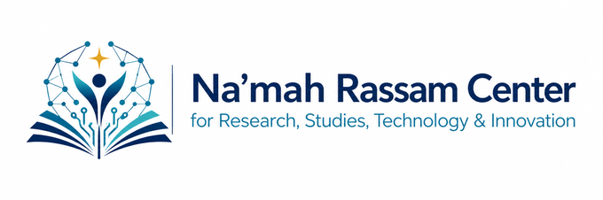
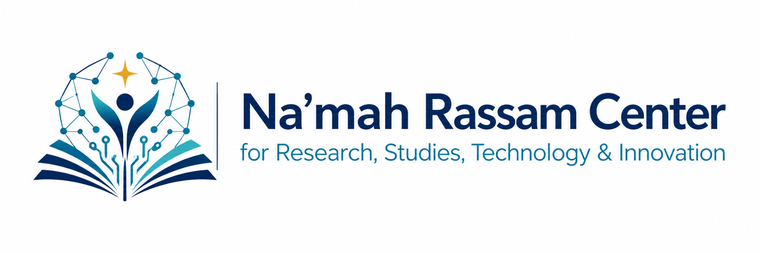
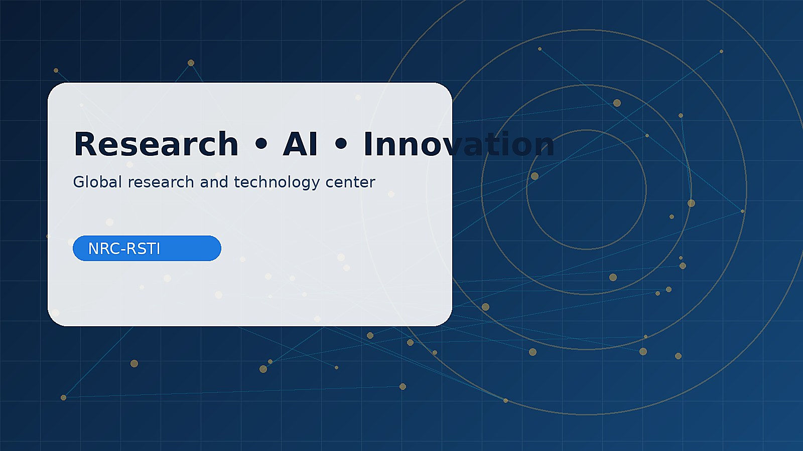
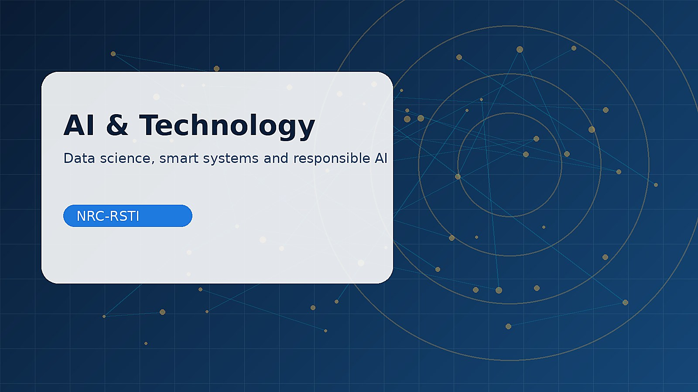
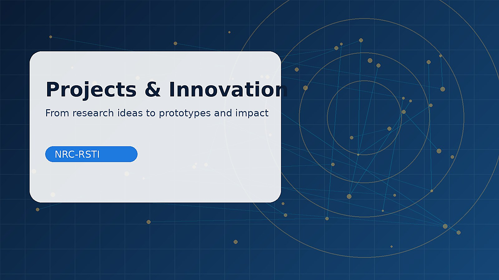
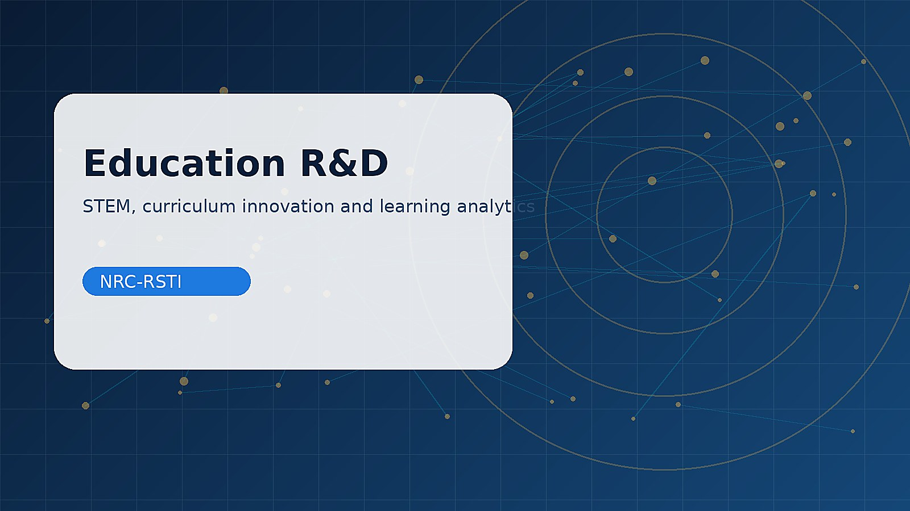

# Full Source Code

---

## `GITHUB_UPLOAD_CHECKLIST.md`

```md
# GitHub Upload Checklist

ارفع كل هذه العناصر إلى GitHub:

- index.html
- about.html
- research.html
- ai-technology.html
- education-rd.html
- consulting.html
- academy.html
- publications.html
- projects.html
- events.html
- partners.html
- contact.html
- css/
- js/
- assets/
- README.md

لا ترفع ملف ZIP نفسه.
يجب أن يكون ملف index.html في الجذر مباشرة، وليس داخل مجلد آخر.

```

---

## `README.md`

```md
# مركز نعمة رسام للأبحاث والدراسات

هذا مشروع موقع ثابت احترافي وجاهز للنشر على GitHub Pages لـ **مركز نعمة رسام للأبحاث والدراسات**.

## طريقة التشغيل محليًا

افتح ملف `index.html` مباشرة في المتصفح، أو استخدم إضافة Live Server في VS Code.

## طريقة الرفع إلى GitHub

بعد فك الضغط، ادخل داخل مجلد المشروع وارفع **كل المحتويات** إلى المستودع، وليس ملف ZIP.

يجب أن تظهر في GitHub هذه الملفات والمجلدات في الجذر:

```text
index.html
about.html
research.html
ai-technology.html
education-rd.html
consulting.html
academy.html
publications.html
projects.html
events.html
partners.html
contact.html
css/
js/
assets/
README.md
```

## تفعيل GitHub Pages

Settings → Pages → Deploy from a branch → main → /root → Save

الرابط المتوقع:
`https://USERNAME.github.io/namah-rassam-center/`

## تعديل البريد

البريد الافتراضي:
`info@namahrassam.org`

عدله في:
- `contact.html`
- `js/main.js`

## الصور المضمنة

تم تضمين الصور التالية داخل `assets/images/`:

- `logo.png`
- `logo-header.png`
- `logo-footer.png`
- `favicon.png`
- `favicon.ico`
- `hero-center.jpg`
- `about-center.jpg`
- `research-lab.jpg`
- `ai-technology.jpg`
- `education-rd.jpg`
- `consulting.jpg`
- `academy.jpg`
- `projects-innovation.jpg`
- `events-forum.jpg`
- `partners.jpg`

## ملاحظة

هذه نسخة ثابتة Static Website، لا تحتاج قاعدة بيانات ولا خادم Backend.

```

---

## `about.html`

```html
<!DOCTYPE html>
<html lang="ar" dir="rtl">
<head>
  <meta charset="UTF-8" />
  <meta name="viewport" content="width=device-width, initial-scale=1.0" />
  <title>عن المركز | مركز نعمة رسام للأبحاث والدراسات</title>
  <meta name="description" content="مركز بحثي وتقني وتعليمي واستشاري متعدد التخصصات في البحث العلمي، الذكاء الاصطناعي، التكنولوجيا، التعليم، التطوير، الابتكار، والاستشارات." />
  <meta name="theme-color" content="#0B1F3A" />
  <meta property="og:title" content="مركز نعمة رسام للأبحاث والدراسات" />
  <meta property="og:description" content="بحثٌ للمعرفة، تقنيةٌ للأثر، وتعليمٌ للمستقبل." />
  <meta property="og:type" content="website" />
  <link rel="icon" href="assets/images/favicon.ico" />
  <link rel="apple-touch-icon" href="assets/images/favicon.png" />
  <link rel="stylesheet" href="css/style.css" />
</head>
<body>
  <a class="skip-link" href="#main">تجاوز إلى المحتوى</a>

  <header class="site-header" id="siteHeader">
    <div class="container nav-shell">
      <a class="brand" href="index.html" aria-label="مركز نعمة رسام للأبحاث والدراسات">
        
      </a>

      <button class="menu-toggle" id="menuToggle" type="button" aria-label="فتح القائمة" aria-expanded="false" aria-controls="mainNav">
        <span></span><span></span><span></span>
      </button>

      <nav class="main-nav" id="mainNav" aria-label="القائمة الرئيسية">
          <a class="nav-link" href="index.html">الرئيسية</a>
          <a class="nav-link active" href="about.html">عن المركز</a>
          <a class="nav-link" href="research.html">الأبحاث</a>
          <a class="nav-link" href="ai-technology.html">الذكاء الاصطناعي والتقنية</a>
          <a class="nav-link" href="education-rd.html">التعليم والتطوير</a>
          <a class="nav-link" href="consulting.html">الاستشارات</a>
          <a class="nav-link" href="academy.html">الأكاديمية</a>
          <a class="nav-link" href="publications.html">المنشورات</a>
          <a class="nav-link" href="projects.html">المشاريع</a>
          <a class="nav-link" href="events.html">الفعاليات</a>
          <a class="nav-link" href="partners.html">الشراكات</a>
          <a class="nav-link" href="contact.html">تواصل</a>
      </nav>
    </div>
  </header>

  <main id="main">

<section class="page-hero page-hero-image" style="--page-image: url('../assets/images/about-center.jpg')">
  <div class="container page-hero-grid">
    <div class="reveal">
      <span class="eyebrow">About the Center</span>
      <h1>عن المركز</h1>
      <p>هوية مركز بحثي وتقني وتعليمي واستشاري متعدد التخصصات يعمل على تحويل المعرفة إلى برامج ومشاريع وحلول ذات أثر.</p>
    </div>
    <div class="page-hero-card reveal" aria-hidden="true">
      <span>بحثٌ للمعرفة، تقنيةٌ للأثر، وتعليمٌ للمستقبل.</span>
    </div>
  </div>
</section>

<section class="section">
  <div class="container two-col">
    <div class="content-card reveal">
      <h2>من نحن</h2>
      <p>
        مركز نعمة رسام للأبحاث والدراسات هو منصة بحثية وتقنية وتعليمية واستشارية
        تهدف إلى إنتاج المعرفة، تطوير الحلول الذكية، دعم الابتكار، وتمكين الباحثين
        والمؤسسات من توظيف البحث العلمي والذكاء الاصطناعي والتكنولوجيا لخدمة التعليم والتنمية.
      </p>
      <p>
        لا يقتصر المركز على فئة واحدة؛ بل يخدم الباحثين، الطلاب، المعلمين، المدارس،
        الجامعات، المؤسسات، المشاريع التقنية، ومجتمع الابتكار.
      </p>
    </div>
    <div class="content-card reveal">
      <h2>القيم المؤسسية</h2>
      <ul class="check-list">
        <li>النزاهة العلمية والأخلاق البحثية.</li>
        <li>العمل المبني على الأدلة والبيانات.</li>
        <li>الابتكار المسؤول والذكاء الاصطناعي الأخلاقي.</li>
        <li>التمكين وبناء القدرات.</li>
        <li>الشراكة والتأثير المجتمعي.</li>
      </ul>
    </div>
  </div>
</section>

<section class="section muted">
  <div class="container vision-grid">
    <article class="reveal"><span>01</span><h2>الرؤية</h2><p>أن يصبح المركز منصة بحثية وتقنية وتعليمية رائدة تسهم في إنتاج المعرفة وتطوير الحلول الذكية ودعم الابتكار.</p></article>
    <article class="reveal"><span>02</span><h2>الرسالة</h2><p>تقديم أبحاث ودراسات واستشارات وبرامج تدريبية وحلول تقنية مبنية على الأدلة في مجالات البحث، AI، التعليم، والابتكار.</p></article>
    <article class="reveal"><span>03</span><h2>الشعار الفكري</h2><p>بحثٌ للمعرفة، تقنيةٌ للأثر، وتعليمٌ للمستقبل.</p></article>
  </div>
</section>

  </main>

  <button class="back-to-top" id="backToTop" type="button" aria-label="العودة إلى الأعلى">↑</button>

  <footer class="site-footer">
    <div class="container footer-grid">
      <section>
        <a class="footer-brand" href="index.html">
          
        </a>
        <p>بحثٌ للمعرفة، تقنيةٌ للأثر، وتعليمٌ للمستقبل.</p>
        <p class="footer-en">Research for Knowledge, Technology for Impact, Education for the Future.</p>
      </section>

      <section>
        <h2>محاور المركز</h2>
        <ul>
          <li>الأبحاث والدراسات</li>
          <li>الذكاء الاصطناعي والتقنية</li>
          <li>التعليم والبحث والتطوير</li>
          <li>الاستشارات وبناء القدرات</li>
        </ul>
      </section>

      <section>
        <h2>روابط سريعة</h2>
        <ul>
          <li><a href="consulting.html">الخدمات الاستشارية</a></li>
          <li><a href="academy.html">أكاديمية التدريب</a></li>
          <li><a href="publications.html">المنشورات</a></li>
          <li><a href="contact.html">تواصل معنا</a></li>
        </ul>
      </section>
    </div>

    <div class="container footer-bottom">
      <span>© <span id="year">2026</span> مركز نعمة رسام للأبحاث والدراسات. جميع الحقوق محفوظة.</span>
      <span>Static website ready for GitHub Pages.</span>
    </div>
  </footer>

  <script src="js/main.js"></script>
</body>
</html>

```

---

## `academy.html`

```html
<!DOCTYPE html>
<html lang="ar" dir="rtl">
<head>
  <meta charset="UTF-8" />
  <meta name="viewport" content="width=device-width, initial-scale=1.0" />
  <title>الأكاديمية | مركز نعمة رسام للأبحاث والدراسات</title>
  <meta name="description" content="مركز بحثي وتقني وتعليمي واستشاري متعدد التخصصات في البحث العلمي، الذكاء الاصطناعي، التكنولوجيا، التعليم، التطوير، الابتكار، والاستشارات." />
  <meta name="theme-color" content="#0B1F3A" />
  <meta property="og:title" content="مركز نعمة رسام للأبحاث والدراسات" />
  <meta property="og:description" content="بحثٌ للمعرفة، تقنيةٌ للأثر، وتعليمٌ للمستقبل." />
  <meta property="og:type" content="website" />
  <link rel="icon" href="assets/images/favicon.ico" />
  <link rel="apple-touch-icon" href="assets/images/favicon.png" />
  <link rel="stylesheet" href="css/style.css" />
</head>
<body>
  <a class="skip-link" href="#main">تجاوز إلى المحتوى</a>

  <header class="site-header" id="siteHeader">
    <div class="container nav-shell">
      <a class="brand" href="index.html" aria-label="مركز نعمة رسام للأبحاث والدراسات">
        
      </a>

      <button class="menu-toggle" id="menuToggle" type="button" aria-label="فتح القائمة" aria-expanded="false" aria-controls="mainNav">
        <span></span><span></span><span></span>
      </button>

      <nav class="main-nav" id="mainNav" aria-label="القائمة الرئيسية">
          <a class="nav-link" href="index.html">الرئيسية</a>
          <a class="nav-link" href="about.html">عن المركز</a>
          <a class="nav-link" href="research.html">الأبحاث</a>
          <a class="nav-link" href="ai-technology.html">الذكاء الاصطناعي والتقنية</a>
          <a class="nav-link" href="education-rd.html">التعليم والتطوير</a>
          <a class="nav-link" href="consulting.html">الاستشارات</a>
          <a class="nav-link active" href="academy.html">الأكاديمية</a>
          <a class="nav-link" href="publications.html">المنشورات</a>
          <a class="nav-link" href="projects.html">المشاريع</a>
          <a class="nav-link" href="events.html">الفعاليات</a>
          <a class="nav-link" href="partners.html">الشراكات</a>
          <a class="nav-link" href="contact.html">تواصل</a>
      </nav>
    </div>
  </header>

  <main id="main">

<section class="page-hero page-hero-image" style="--page-image: url('../assets/images/academy.jpg')">
  <div class="container page-hero-grid">
    <div class="reveal">
      <span class="eyebrow">Training & Capacity Building Academy</span>
      <h1>أكاديمية التدريب وبناء القدرات</h1>
      <p>مسارات تدريبية احترافية تربط بين المعرفة النظرية، التطبيق العملي، والمخرجات القابلة للتوثيق والنشر.</p>
    </div>
    <div class="page-hero-card reveal" aria-hidden="true">
      <span>بحثٌ للمعرفة، تقنيةٌ للأثر، وتعليمٌ للمستقبل.</span>
    </div>
  </div>
</section>

<section class="section">
  <div class="container course-grid">
    <article class="course-card reveal"><span>Research</span><h2>برنامج الباحث المحترف</h2><p>من الفكرة إلى الورقة العلمية: مشكلة البحث، الأدبيات، المنهجية، الكتابة، والنشر.</p></article>
    <article class="course-card reveal"><span>AI</span><h2>برنامج الذكاء الاصطناعي التطبيقي</h2><p>Python، تعلم آلة، تحليل بيانات، AI for Research، وResponsible AI.</p></article>
    <article class="course-card reveal"><span>Tech</span><h2>برنامج التقنيات الذكية</h2><p>إلكترونيات، Arduino/ESP32، IoT، روبوتات، MATLAB/Simulink، وأنظمة مدمجة.</p></article>
    <article class="course-card reveal"><span>Education</span><h2>برنامج تطوير التعليم</h2><p>STEM، التعلم بالمشاريع، تدريب المعلمين، التعليم الرقمي، وتقييم الأثر.</p></article>
    <article class="course-card reveal"><span>Publishing</span><h2>برنامج النشر الأكاديمي</h2><p>كتابة الملخص، المقدمة، مراجعة الأدبيات، الجداول، العروض، والبوسترات العلمية.</p></article>
    <article class="course-card reveal"><span>Innovation</span><h2>برنامج الابتكار وريادة المشاريع</h2><p>Design Thinking، Prototype، Pitch Deck، دراسة حالة، وتحويل الفكرة إلى مشروع.</p></article>
  </div>
</section>

  </main>

  <button class="back-to-top" id="backToTop" type="button" aria-label="العودة إلى الأعلى">↑</button>

  <footer class="site-footer">
    <div class="container footer-grid">
      <section>
        <a class="footer-brand" href="index.html">
          
        </a>
        <p>بحثٌ للمعرفة، تقنيةٌ للأثر، وتعليمٌ للمستقبل.</p>
        <p class="footer-en">Research for Knowledge, Technology for Impact, Education for the Future.</p>
      </section>

      <section>
        <h2>محاور المركز</h2>
        <ul>
          <li>الأبحاث والدراسات</li>
          <li>الذكاء الاصطناعي والتقنية</li>
          <li>التعليم والبحث والتطوير</li>
          <li>الاستشارات وبناء القدرات</li>
        </ul>
      </section>

      <section>
        <h2>روابط سريعة</h2>
        <ul>
          <li><a href="consulting.html">الخدمات الاستشارية</a></li>
          <li><a href="academy.html">أكاديمية التدريب</a></li>
          <li><a href="publications.html">المنشورات</a></li>
          <li><a href="contact.html">تواصل معنا</a></li>
        </ul>
      </section>
    </div>

    <div class="container footer-bottom">
      <span>© <span id="year">2026</span> مركز نعمة رسام للأبحاث والدراسات. جميع الحقوق محفوظة.</span>
      <span>Static website ready for GitHub Pages.</span>
    </div>
  </footer>

  <script src="js/main.js"></script>
</body>
</html>

```

---

## `ai-technology.html`

```html
<!DOCTYPE html>
<html lang="ar" dir="rtl">
<head>
  <meta charset="UTF-8" />
  <meta name="viewport" content="width=device-width, initial-scale=1.0" />
  <title>الذكاء الاصطناعي والتقنية | مركز نعمة رسام للأبحاث والدراسات</title>
  <meta name="description" content="مركز بحثي وتقني وتعليمي واستشاري متعدد التخصصات في البحث العلمي، الذكاء الاصطناعي، التكنولوجيا، التعليم، التطوير، الابتكار، والاستشارات." />
  <meta name="theme-color" content="#0B1F3A" />
  <meta property="og:title" content="مركز نعمة رسام للأبحاث والدراسات" />
  <meta property="og:description" content="بحثٌ للمعرفة، تقنيةٌ للأثر، وتعليمٌ للمستقبل." />
  <meta property="og:type" content="website" />
  <link rel="icon" href="assets/images/favicon.ico" />
  <link rel="apple-touch-icon" href="assets/images/favicon.png" />
  <link rel="stylesheet" href="css/style.css" />
</head>
<body>
  <a class="skip-link" href="#main">تجاوز إلى المحتوى</a>

  <header class="site-header" id="siteHeader">
    <div class="container nav-shell">
      <a class="brand" href="index.html" aria-label="مركز نعمة رسام للأبحاث والدراسات">
        
      </a>

      <button class="menu-toggle" id="menuToggle" type="button" aria-label="فتح القائمة" aria-expanded="false" aria-controls="mainNav">
        <span></span><span></span><span></span>
      </button>

      <nav class="main-nav" id="mainNav" aria-label="القائمة الرئيسية">
          <a class="nav-link" href="index.html">الرئيسية</a>
          <a class="nav-link" href="about.html">عن المركز</a>
          <a class="nav-link" href="research.html">الأبحاث</a>
          <a class="nav-link active" href="ai-technology.html">الذكاء الاصطناعي والتقنية</a>
          <a class="nav-link" href="education-rd.html">التعليم والتطوير</a>
          <a class="nav-link" href="consulting.html">الاستشارات</a>
          <a class="nav-link" href="academy.html">الأكاديمية</a>
          <a class="nav-link" href="publications.html">المنشورات</a>
          <a class="nav-link" href="projects.html">المشاريع</a>
          <a class="nav-link" href="events.html">الفعاليات</a>
          <a class="nav-link" href="partners.html">الشراكات</a>
          <a class="nav-link" href="contact.html">تواصل</a>
      </nav>
    </div>
  </header>

  <main id="main">

<section class="page-hero page-hero-image" style="--page-image: url('../assets/images/ai-technology.jpg')">
  <div class="container page-hero-grid">
    <div class="reveal">
      <span class="eyebrow">AI & Technology Institute</span>
      <h1>الذكاء الاصطناعي والتقنية</h1>
      <p>معهد تطبيقي يدمج البحث، التدريب، النمذجة، وتحويل الحلول التقنية إلى مشاريع قابلة للاختبار والتطوير.</p>
    </div>
    <div class="page-hero-card reveal" aria-hidden="true">
      <span>بحثٌ للمعرفة، تقنيةٌ للأثر، وتعليمٌ للمستقبل.</span>
    </div>
  </div>
</section>

<section class="section">
  <div class="container lab-grid">
    <article class="lab-card reveal"><h2>Applied AI Lab</h2><p>تعلم آلة، تعلم عميق، ذكاء اصطناعي توليدي، نمذجة، واستخدام AI في التعليم والبحث والهندسة.</p></article>
    <article class="lab-card reveal"><h2>Data Science Unit</h2><p>تنظيف البيانات، تحليلها، تصورها، بناء مؤشرات، ولوحات متابعة للبرامج والمشاريع.</p></article>
    <article class="lab-card reveal"><h2>Intelligent Systems Lab</h2><p>إلكترونيات، IoT، أنظمة مدمجة، روبوتات، مستشعرات، ومحاكاة MATLAB/Simulink.</p></article>
    <article class="lab-card reveal"><h2>Responsible AI</h2><p>أخلاقيات الذكاء الاصطناعي، الخصوصية، نزاهة البحث، التحيز الخوارزمي، والاستخدام المسؤول.</p></article>
  </div>
</section>

<section class="section section-dark">
  <div class="container">
    <div class="section-head reveal"><span class="section-kicker">Technology Stack</span><h2>مجالات تقنية يمكن للمركز تقديمها</h2></div>
    <div class="tag-cloud reveal">
      <span>Python</span><span>C++</span><span>Machine Learning</span><span>Deep Learning</span>
      <span>Data Analysis</span><span>Arduino</span><span>ESP32</span><span>IoT</span>
      <span>Robotics</span><span>MATLAB</span><span>Simulink</span><span>Embedded Systems</span>
      <span>Computer Vision</span><span>Control Systems</span><span>AI for Research</span>
    </div>
  </div>
</section>

  </main>

  <button class="back-to-top" id="backToTop" type="button" aria-label="العودة إلى الأعلى">↑</button>

  <footer class="site-footer">
    <div class="container footer-grid">
      <section>
        <a class="footer-brand" href="index.html">
          
        </a>
        <p>بحثٌ للمعرفة، تقنيةٌ للأثر، وتعليمٌ للمستقبل.</p>
        <p class="footer-en">Research for Knowledge, Technology for Impact, Education for the Future.</p>
      </section>

      <section>
        <h2>محاور المركز</h2>
        <ul>
          <li>الأبحاث والدراسات</li>
          <li>الذكاء الاصطناعي والتقنية</li>
          <li>التعليم والبحث والتطوير</li>
          <li>الاستشارات وبناء القدرات</li>
        </ul>
      </section>

      <section>
        <h2>روابط سريعة</h2>
        <ul>
          <li><a href="consulting.html">الخدمات الاستشارية</a></li>
          <li><a href="academy.html">أكاديمية التدريب</a></li>
          <li><a href="publications.html">المنشورات</a></li>
          <li><a href="contact.html">تواصل معنا</a></li>
        </ul>
      </section>
    </div>

    <div class="container footer-bottom">
      <span>© <span id="year">2026</span> مركز نعمة رسام للأبحاث والدراسات. جميع الحقوق محفوظة.</span>
      <span>Static website ready for GitHub Pages.</span>
    </div>
  </footer>

  <script src="js/main.js"></script>
</body>
</html>

```

---

## `assets/icons/ai.svg`

```svg
<svg xmlns="http://www.w3.org/2000/svg" width="52" height="52" viewBox="0 0 50 50" fill="none" aria-hidden="true">
  <rect width="50" height="50" rx="16" fill="#00a8c8" fill-opacity="0.12"/>
  <path d="M14 14h22v22H14z M20 8v6 M30 8v6 M20 36v6 M30 36v6 M8 20h6 M8 30h6 M36 20h6 M36 30h6 M21 23h8v8h-8z" stroke="#00a8c8" stroke-width="2.4" stroke-linecap="round" stroke-linejoin="round"/>
</svg>

```

---

## `assets/icons/consulting.svg`

```svg
<svg xmlns="http://www.w3.org/2000/svg" width="52" height="52" viewBox="0 0 50 50" fill="none" aria-hidden="true">
  <rect width="50" height="50" rx="16" fill="#1f7ae0" fill-opacity="0.12"/>
  <path d="M14 12h22a5 5 0 015 5v13a5 5 0 01-5 5H24l-9 7v-7h-1a5 5 0 01-5-5V17a5 5 0 015-5z M18 20h16 M18 27h10" stroke="#1f7ae0" stroke-width="2.4" stroke-linecap="round" stroke-linejoin="round"/>
</svg>

```

---

## `assets/icons/data.svg`

```svg
<svg xmlns="http://www.w3.org/2000/svg" width="52" height="52" viewBox="0 0 50 50" fill="none" aria-hidden="true">
  <rect width="50" height="50" rx="16" fill="#00a8c8" fill-opacity="0.12"/>
  <path d="M10 14c0-4 30-4 30 0v22c0 4-30 4-30 0z M10 14c0 4 30 4 30 0 M10 25c0 4 30 4 30 0 M10 36c0 4 30 4 30 0" stroke="#00a8c8" stroke-width="2.4" stroke-linecap="round" stroke-linejoin="round"/>
</svg>

```

---

## `assets/icons/education.svg`

```svg
<svg xmlns="http://www.w3.org/2000/svg" width="52" height="52" viewBox="0 0 50 50" fill="none" aria-hidden="true">
  <rect width="50" height="50" rx="16" fill="#d7a84a" fill-opacity="0.12"/>
  <path d="M6 18l19-9 19 9-19 9z M14 24v9c6 5 16 5 22 0v-9 M40 20v13" stroke="#d7a84a" stroke-width="2.4" stroke-linecap="round" stroke-linejoin="round"/>
</svg>

```

---

## `assets/icons/ethics.svg`

```svg
<svg xmlns="http://www.w3.org/2000/svg" width="52" height="52" viewBox="0 0 50 50" fill="none" aria-hidden="true">
  <rect width="50" height="50" rx="16" fill="#d7a84a" fill-opacity="0.12"/>
  <path d="M25 7l16 7v11c0 10-7 17-16 20C16 42 9 35 9 25V14z M18 25l5 5 10-11" stroke="#d7a84a" stroke-width="2.4" stroke-linecap="round" stroke-linejoin="round"/>
</svg>

```

---

## `assets/icons/innovation.svg`

```svg
<svg xmlns="http://www.w3.org/2000/svg" width="52" height="52" viewBox="0 0 50 50" fill="none" aria-hidden="true">
  <rect width="50" height="50" rx="16" fill="#d7a84a" fill-opacity="0.12"/>
  <path d="M25 7a13 13 0 00-8 23c2 2 3 4 3 7h10c0-3 1-5 3-7A13 13 0 0025 7z M20 41h10 M21 45h8 M25 13v8 M18 20h14" stroke="#d7a84a" stroke-width="2.4" stroke-linecap="round" stroke-linejoin="round"/>
</svg>

```

---

## `assets/icons/research.svg`

```svg
<svg xmlns="http://www.w3.org/2000/svg" width="52" height="52" viewBox="0 0 50 50" fill="none" aria-hidden="true">
  <rect width="50" height="50" rx="16" fill="#1f7ae0" fill-opacity="0.12"/>
  <path d="M11 5h22v34H11z M16 12h12 M16 18h12 M16 24h8 M33 11l6-5v30l-6-4" stroke="#1f7ae0" stroke-width="2.4" stroke-linecap="round" stroke-linejoin="round"/>
</svg>

```

---

## `assets/icons/technology.svg`

```svg
<svg xmlns="http://www.w3.org/2000/svg" width="52" height="52" viewBox="0 0 50 50" fill="none" aria-hidden="true">
  <rect width="50" height="50" rx="16" fill="#1f7ae0" fill-opacity="0.12"/>
  <path d="M12 16h28v20H12z M18 10h16v6 M20 36v5h10v-5 M18 22h14 M18 28h8" stroke="#1f7ae0" stroke-width="2.4" stroke-linecap="round" stroke-linejoin="round"/>
</svg>

```

---

## `assets/icons/training.svg`

```svg
<svg xmlns="http://www.w3.org/2000/svg" width="52" height="52" viewBox="0 0 50 50" fill="none" aria-hidden="true">
  <rect width="50" height="50" rx="16" fill="#00a8c8" fill-opacity="0.12"/>
  <path d="M10 14h30v22H10z M15 20h10 M15 26h18 M15 32h14 M30 8v6 M20 8v6" stroke="#00a8c8" stroke-width="2.4" stroke-linecap="round" stroke-linejoin="round"/>
</svg>

```

---

## `assets/manifest.json`

```json
{
  "pages": [
    "index.html",
    "about.html",
    "research.html",
    "ai-technology.html",
    "education-rd.html",
    "consulting.html",
    "academy.html",
    "publications.html",
    "projects.html",
    "events.html",
    "partners.html",
    "contact.html"
  ],
  "css": [
    "css/style.css"
  ],
  "js": [
    "js/main.js"
  ],
  "images": [
    "about-center.jpg",
    "academy.jpg",
    "ai-technology.jpg",
    "consulting.jpg",
    "education-rd.jpg",
    "events-forum.jpg",
    "favicon.ico",
    "favicon.png",
    "hero-center.jpg",
    "logo-footer.png",
    "logo-header.png",
    "logo.png",
    "partners.jpg",
    "projects-innovation.jpg",
    "research-lab.jpg"
  ],
  "icons": [
    "ai.svg",
    "consulting.svg",
    "data.svg",
    "education.svg",
    "ethics.svg",
    "innovation.svg",
    "research.svg",
    "technology.svg",
    "training.svg"
  ]
}
```

---

## `consulting.html`

```html
<!DOCTYPE html>
<html lang="ar" dir="rtl">
<head>
  <meta charset="UTF-8" />
  <meta name="viewport" content="width=device-width, initial-scale=1.0" />
  <title>الاستشارات | مركز نعمة رسام للأبحاث والدراسات</title>
  <meta name="description" content="مركز بحثي وتقني وتعليمي واستشاري متعدد التخصصات في البحث العلمي، الذكاء الاصطناعي، التكنولوجيا، التعليم، التطوير، الابتكار، والاستشارات." />
  <meta name="theme-color" content="#0B1F3A" />
  <meta property="og:title" content="مركز نعمة رسام للأبحاث والدراسات" />
  <meta property="og:description" content="بحثٌ للمعرفة، تقنيةٌ للأثر، وتعليمٌ للمستقبل." />
  <meta property="og:type" content="website" />
  <link rel="icon" href="assets/images/favicon.ico" />
  <link rel="apple-touch-icon" href="assets/images/favicon.png" />
  <link rel="stylesheet" href="css/style.css" />
</head>
<body>
  <a class="skip-link" href="#main">تجاوز إلى المحتوى</a>

  <header class="site-header" id="siteHeader">
    <div class="container nav-shell">
      <a class="brand" href="index.html" aria-label="مركز نعمة رسام للأبحاث والدراسات">
        
      </a>

      <button class="menu-toggle" id="menuToggle" type="button" aria-label="فتح القائمة" aria-expanded="false" aria-controls="mainNav">
        <span></span><span></span><span></span>
      </button>

      <nav class="main-nav" id="mainNav" aria-label="القائمة الرئيسية">
          <a class="nav-link" href="index.html">الرئيسية</a>
          <a class="nav-link" href="about.html">عن المركز</a>
          <a class="nav-link" href="research.html">الأبحاث</a>
          <a class="nav-link" href="ai-technology.html">الذكاء الاصطناعي والتقنية</a>
          <a class="nav-link" href="education-rd.html">التعليم والتطوير</a>
          <a class="nav-link active" href="consulting.html">الاستشارات</a>
          <a class="nav-link" href="academy.html">الأكاديمية</a>
          <a class="nav-link" href="publications.html">المنشورات</a>
          <a class="nav-link" href="projects.html">المشاريع</a>
          <a class="nav-link" href="events.html">الفعاليات</a>
          <a class="nav-link" href="partners.html">الشراكات</a>
          <a class="nav-link" href="contact.html">تواصل</a>
      </nav>
    </div>
  </header>

  <main id="main">

<section class="page-hero page-hero-image" style="--page-image: url('../assets/images/consulting.jpg')">
  <div class="container page-hero-grid">
    <div class="reveal">
      <span class="eyebrow">Research & Technology Consulting</span>
      <h1>الخدمات الاستشارية</h1>
      <p>خدمات بحثية وتقنية وتعليمية تساعد الباحثين والمؤسسات على تطوير أعمالهم وفق معايير علمية ومهنية.</p>
    </div>
    <div class="page-hero-card reveal" aria-hidden="true">
      <span>بحثٌ للمعرفة، تقنيةٌ للأثر، وتعليمٌ للمستقبل.</span>
    </div>
  </div>
</section>

<section class="section">
  <div class="container service-list">
    <article class="service-card reveal"><h2>استشارات بحثية وأكاديمية</h2><p>اختيار الموضوع، بناء المشكلة، تصميم المنهجية، مراجعة الأدبيات، وتجهيز البحث قبل النشر.</p><ul><li>Research Design</li><li>Systematic Review</li><li>Academic Writing</li></ul></article>
    <article class="service-card reveal"><h2>استشارات تحليل البيانات</h2><p>تنظيف البيانات، التحليل الإحصائي، تصور النتائج، وبناء مؤشرات وتقارير مهنية.</p><ul><li>Data Analysis</li><li>Dashboards</li><li>Evaluation Reports</li></ul></article>
    <article class="service-card reveal"><h2>استشارات تقنية وذكاء اصطناعي</h2><p>تحديد حلول AI المناسبة، تصميم نماذج أولية، تطوير أفكار IoT، ومحاكاة الأنظمة.</p><ul><li>AI Prototyping</li><li>IoT Systems</li><li>Simulation</li></ul></article>
    <article class="service-card reveal"><h2>استشارات تعليمية وتطوير برامج</h2><p>تطوير الحقائب التدريبية، تقييم البرامج، بناء مسارات تعليمية، وقياس الأثر.</p><ul><li>Curriculum Design</li><li>Teacher Training</li><li>Impact Evaluation</li></ul></article>
  </div>
</section>

<section class="section muted">
  <div class="container cta reveal">
    <div><h2>طلب استشارة</h2><p>استخدم صفحة التواصل لإرسال نوع الاستشارة المطلوبة، وسيرشدك النموذج إلى المعلومات الأساسية.</p></div>
    <a class="btn btn-primary" href="contact.html">انتقل إلى نموذج التواصل</a>
  </div>
</section>

  </main>

  <button class="back-to-top" id="backToTop" type="button" aria-label="العودة إلى الأعلى">↑</button>

  <footer class="site-footer">
    <div class="container footer-grid">
      <section>
        <a class="footer-brand" href="index.html">
          
        </a>
        <p>بحثٌ للمعرفة، تقنيةٌ للأثر، وتعليمٌ للمستقبل.</p>
        <p class="footer-en">Research for Knowledge, Technology for Impact, Education for the Future.</p>
      </section>

      <section>
        <h2>محاور المركز</h2>
        <ul>
          <li>الأبحاث والدراسات</li>
          <li>الذكاء الاصطناعي والتقنية</li>
          <li>التعليم والبحث والتطوير</li>
          <li>الاستشارات وبناء القدرات</li>
        </ul>
      </section>

      <section>
        <h2>روابط سريعة</h2>
        <ul>
          <li><a href="consulting.html">الخدمات الاستشارية</a></li>
          <li><a href="academy.html">أكاديمية التدريب</a></li>
          <li><a href="publications.html">المنشورات</a></li>
          <li><a href="contact.html">تواصل معنا</a></li>
        </ul>
      </section>
    </div>

    <div class="container footer-bottom">
      <span>© <span id="year">2026</span> مركز نعمة رسام للأبحاث والدراسات. جميع الحقوق محفوظة.</span>
      <span>Static website ready for GitHub Pages.</span>
    </div>
  </footer>

  <script src="js/main.js"></script>
</body>
</html>

```

---

## `contact.html`

```html
<!DOCTYPE html>
<html lang="ar" dir="rtl">
<head>
  <meta charset="UTF-8" />
  <meta name="viewport" content="width=device-width, initial-scale=1.0" />
  <title>تواصل | مركز نعمة رسام للأبحاث والدراسات</title>
  <meta name="description" content="مركز بحثي وتقني وتعليمي واستشاري متعدد التخصصات في البحث العلمي، الذكاء الاصطناعي، التكنولوجيا، التعليم، التطوير، الابتكار، والاستشارات." />
  <meta name="theme-color" content="#0B1F3A" />
  <meta property="og:title" content="مركز نعمة رسام للأبحاث والدراسات" />
  <meta property="og:description" content="بحثٌ للمعرفة، تقنيةٌ للأثر، وتعليمٌ للمستقبل." />
  <meta property="og:type" content="website" />
  <link rel="icon" href="assets/images/favicon.ico" />
  <link rel="apple-touch-icon" href="assets/images/favicon.png" />
  <link rel="stylesheet" href="css/style.css" />
</head>
<body>
  <a class="skip-link" href="#main">تجاوز إلى المحتوى</a>

  <header class="site-header" id="siteHeader">
    <div class="container nav-shell">
      <a class="brand" href="index.html" aria-label="مركز نعمة رسام للأبحاث والدراسات">
        
      </a>

      <button class="menu-toggle" id="menuToggle" type="button" aria-label="فتح القائمة" aria-expanded="false" aria-controls="mainNav">
        <span></span><span></span><span></span>
      </button>

      <nav class="main-nav" id="mainNav" aria-label="القائمة الرئيسية">
          <a class="nav-link" href="index.html">الرئيسية</a>
          <a class="nav-link" href="about.html">عن المركز</a>
          <a class="nav-link" href="research.html">الأبحاث</a>
          <a class="nav-link" href="ai-technology.html">الذكاء الاصطناعي والتقنية</a>
          <a class="nav-link" href="education-rd.html">التعليم والتطوير</a>
          <a class="nav-link" href="consulting.html">الاستشارات</a>
          <a class="nav-link" href="academy.html">الأكاديمية</a>
          <a class="nav-link" href="publications.html">المنشورات</a>
          <a class="nav-link" href="projects.html">المشاريع</a>
          <a class="nav-link" href="events.html">الفعاليات</a>
          <a class="nav-link" href="partners.html">الشراكات</a>
          <a class="nav-link active" href="contact.html">تواصل</a>
      </nav>
    </div>
  </header>

  <main id="main">

<section class="page-hero page-hero-image" style="--page-image: url('../assets/images/consulting.jpg')">
  <div class="container page-hero-grid">
    <div class="reveal">
      <span class="eyebrow">Contact</span>
      <h1>تواصل معنا</h1>
      <p>أرسل طلب استشارة، مقترح شراكة، استفسار تدريبي، أو فكرة مشروع بحثي وتقني.</p>
    </div>
    <div class="page-hero-card reveal" aria-hidden="true">
      <span>بحثٌ للمعرفة، تقنيةٌ للأثر، وتعليمٌ للمستقبل.</span>
    </div>
  </div>
</section>

<section class="section">
  <div class="container contact-grid">
    <form class="contact-form reveal" id="contactForm" novalidate>
      <div class="form-row"><label for="name">الاسم الكامل</label><input id="name" name="name" type="text" placeholder="اكتب الاسم هنا" required /><small class="error"></small></div>
      <div class="form-row"><label for="email">البريد الإلكتروني</label><input id="email" name="email" type="email" placeholder="name@example.com" required /><small class="error"></small></div>
      <div class="form-row">
        <label for="service">نوع الطلب</label>
        <select id="service" name="service" required>
          <option value="">اختر نوع الطلب</option>
          <option>استشارة بحثية</option>
          <option>استشارة تقنية / AI</option>
          <option>برنامج تدريبي</option>
          <option>شراكة</option>
          <option>مشروع أو ابتكار</option>
          <option>أخرى</option>
        </select>
        <small class="error"></small>
      </div>
      <div class="form-row"><label for="message">تفاصيل الرسالة</label><textarea id="message" name="message" rows="6" placeholder="اكتب تفاصيل الطلب بشكل مختصر وواضح" required></textarea><small class="error"></small></div>
      <button class="btn btn-primary" type="submit">تجهيز رسالة البريد</button>
      <p class="form-note">النموذج يعمل بدون خادم؛ عند الإرسال سيتم تجهيز رسالة بريد إلكتروني عبر تطبيق البريد لديك.</p>
    </form>

    <aside class="contact-info reveal">
      <h2>بيانات التواصل</h2>
      <ul>
        <li><strong>Email:</strong> info@namahrassam.org</li>
        <li><strong>Location:</strong> Yemen / International Online Center</li>
        <li><strong>Focus:</strong> Research, AI, Technology, Education, Innovation</li>
      </ul>
      <p>يمكنك تعديل البريد والعنوان وروابط التواصل من ملف <code>contact.html</code> وملف <code>js/main.js</code>.</p>
    </aside>
  </div>
</section>

  </main>

  <button class="back-to-top" id="backToTop" type="button" aria-label="العودة إلى الأعلى">↑</button>

  <footer class="site-footer">
    <div class="container footer-grid">
      <section>
        <a class="footer-brand" href="index.html">
          
        </a>
        <p>بحثٌ للمعرفة، تقنيةٌ للأثر، وتعليمٌ للمستقبل.</p>
        <p class="footer-en">Research for Knowledge, Technology for Impact, Education for the Future.</p>
      </section>

      <section>
        <h2>محاور المركز</h2>
        <ul>
          <li>الأبحاث والدراسات</li>
          <li>الذكاء الاصطناعي والتقنية</li>
          <li>التعليم والبحث والتطوير</li>
          <li>الاستشارات وبناء القدرات</li>
        </ul>
      </section>

      <section>
        <h2>روابط سريعة</h2>
        <ul>
          <li><a href="consulting.html">الخدمات الاستشارية</a></li>
          <li><a href="academy.html">أكاديمية التدريب</a></li>
          <li><a href="publications.html">المنشورات</a></li>
          <li><a href="contact.html">تواصل معنا</a></li>
        </ul>
      </section>
    </div>

    <div class="container footer-bottom">
      <span>© <span id="year">2026</span> مركز نعمة رسام للأبحاث والدراسات. جميع الحقوق محفوظة.</span>
      <span>Static website ready for GitHub Pages.</span>
    </div>
  </footer>

  <script src="js/main.js"></script>
</body>
</html>

```

---

## `css/style.css`

```css
:root {
  --bg: #f6f8fc;
  --surface: #ffffff;
  --surface-2: #edf3ff;
  --ink: #0f172a;
  --muted: #5b6678;
  --line: #dfe7f3;
  --primary: #0b1f3a;
  --primary-2: #123c69;
  --accent: #1f7ae0;
  --accent-2: #00a8c8;
  --gold: #d7a84a;
  --danger: #b42318;
  --shadow: 0 18px 45px rgba(15, 23, 42, 0.08);
  --shadow-strong: 0 28px 80px rgba(11, 31, 58, 0.18);
  --radius: 24px;
  --container: 1160px;
}

* { box-sizing: border-box; }
html { scroll-behavior: smooth; }
body {
  margin: 0;
  font-family: Tahoma, Arial, "Segoe UI", sans-serif;
  line-height: 1.85;
  color: var(--ink);
  background: var(--bg);
  overflow-x: hidden;
}
a { color: inherit; }
img { max-width: 100%; display: block; }
.container { width: min(var(--container), calc(100% - 40px)); margin-inline: auto; }

.skip-link {
  position: fixed; top: -80px; right: 16px; z-index: 9999;
  background: var(--primary); color: #fff; padding: 10px 14px;
  border-radius: 12px; text-decoration: none;
}
.skip-link:focus { top: 16px; }

.site-header {
  position: sticky; top: 0; z-index: 1000;
  background: rgba(255, 255, 255, 0.9);
  backdrop-filter: blur(18px);
  border-bottom: 1px solid rgba(223, 231, 243, 0.9);
  transition: box-shadow 0.25s ease, background 0.25s ease;
}
.site-header.scrolled { box-shadow: 0 12px 32px rgba(15, 23, 42, 0.08); background: rgba(255,255,255,0.98); }

.nav-shell {
  min-height: 84px; display: flex; align-items: center; justify-content: space-between; gap: 20px;
}
.brand { display: inline-flex; align-items: center; text-decoration: none; flex: 0 0 auto; }
.brand-logo { height: 58px; width: auto; object-fit: contain; }
.main-nav { display: flex; align-items: center; gap: 4px; flex-wrap: wrap; justify-content: flex-end; }
.nav-link {
  text-decoration: none; color: #263449; font-size: 13px; font-weight: 700;
  padding: 9px 10px; border-radius: 999px; transition: 0.2s ease;
}
.nav-link:hover, .nav-link.active { color: var(--accent); background: var(--surface-2); }

.menu-toggle {
  display: none; border: 0; background: var(--surface-2); width: 46px; height: 46px;
  border-radius: 14px; cursor: pointer; padding: 12px;
}
.menu-toggle span { display: block; height: 2px; background: var(--primary); margin: 5px 0; border-radius: 2px; transition: 0.2s ease; }

.hero {
  position: relative; padding: 96px 0 74px; overflow: hidden;
  background:
    radial-gradient(circle at 8% 10%, rgba(31, 122, 224, 0.18), transparent 28%),
    radial-gradient(circle at 88% 18%, rgba(0, 168, 200, 0.14), transparent 34%),
    linear-gradient(135deg, #f9fbff, #eef5ff 55%, #f6f8fc);
}
.hero::after {
  content: ""; position: absolute; inset: 0; opacity: 0.1;
  background-image: var(--hero-image);
  background-size: cover; background-position: center;
  mix-blend-mode: multiply; pointer-events: none;
}
.hero-grid {
  position: relative; z-index: 1; display: grid; grid-template-columns: 1.12fr 0.88fr; gap: 44px; align-items: center;
}
.eyebrow, .section-kicker {
  display: inline-flex; align-items: center; gap: 8px;
  color: var(--accent); background: rgba(31, 122, 224, 0.10);
  border: 1px solid rgba(31, 122, 224, 0.15);
  padding: 7px 13px; border-radius: 999px;
  font-size: 12px; font-weight: 800; letter-spacing: 0.02em; direction: ltr;
}
.hero h1, .page-hero h1 {
  font-size: clamp(34px, 5vw, 62px); line-height: 1.22; margin: 18px 0;
  color: var(--primary); letter-spacing: -0.04em;
}
.hero-lead, .page-hero p { font-size: 18px; color: var(--muted); max-width: 850px; }
.hero-actions, .cta { display: flex; align-items: center; gap: 14px; flex-wrap: wrap; }
.hero-actions { margin-top: 28px; }

.btn {
  display: inline-flex; align-items: center; justify-content: center; min-height: 48px;
  padding: 12px 22px; border-radius: 999px; border: 1px solid transparent;
  text-decoration: none; font-weight: 900; cursor: pointer;
  transition: transform 0.2s ease, box-shadow 0.2s ease, background 0.2s ease;
}
.btn:hover { transform: translateY(-2px); }
.btn-primary { color: #fff; background: linear-gradient(135deg, var(--primary), var(--accent)); box-shadow: 0 16px 30px rgba(31,122,224,0.23); }
.btn-outline { color: var(--primary); background: rgba(255,255,255,0.72); border-color: var(--line); }
.btn-light { color: var(--primary); background: #fff; }

.hero-stats { margin-top: 34px; display: flex; gap: 14px; flex-wrap: wrap; }
.hero-stats div { min-width: 150px; padding: 16px; border-radius: 18px; background: rgba(255,255,255,0.76); border: 1px solid rgba(223,231,243,0.9); }
.hero-stats strong { display: block; color: var(--accent); font-size: 28px; line-height: 1; }
.hero-stats span { color: var(--muted); font-size: 12px; font-weight: 700; }

.hero-panel {
  background: #fff; border: 1px solid var(--line); box-shadow: var(--shadow-strong);
  border-radius: 34px; overflow: hidden;
}
.hero-panel > img { width: 100%; height: 315px; object-fit: cover; }
.hero-panel-caption { padding: 24px; background: #fff; }
.hero-panel-caption span { color: var(--accent); font-weight: 900; font-size: 12px; direction: ltr; display: block; }
.hero-panel-caption h2 { color: var(--primary); margin: 8px 0; line-height: 1.55; }
.hero-panel-caption p { color: var(--muted); margin: 0; direction: ltr; text-align: left; }

.section { padding: 78px 0; }
.muted { background: #eef4fb; }
.section-dark {
  background: radial-gradient(circle at 12% 20%, rgba(31,122,224,0.22), transparent 24%), linear-gradient(135deg, var(--primary), #102b4e);
  color: #fff;
}
.section-head { text-align: center; max-width: 800px; margin: 0 auto 38px; }
.section-head h2, .split h2, .cta h2 {
  color: var(--primary); font-size: clamp(28px, 3vw, 42px); line-height: 1.35; margin: 12px 0; letter-spacing: -0.025em;
}
.section-head p, .split p, .cta p { color: var(--muted); margin: 0; }
.section-dark .section-head h2, .section-dark .split h2, .section-dark .section-head p, .section-dark .split p { color: #fff; }

.cards-grid, .vision-grid, .lab-grid, .process-grid, .course-grid, .publication-grid, .project-grid, .partner-grid {
  display: grid; grid-template-columns: repeat(3, 1fr); gap: 22px;
}
.cards-grid.compact, .process-grid, .course-grid, .publication-grid, .project-grid, .partner-grid { grid-template-columns: repeat(2, 1fr); }
.lab-grid { grid-template-columns: repeat(4, 1fr); }

.feature-card, .info-card, .content-card, .lab-card, .process-card, .service-card, .course-card, .publication-card, .project-card, .event-card, .partner-card, .vision-grid article {
  background: var(--surface); border: 1px solid var(--line); border-radius: var(--radius); box-shadow: var(--shadow);
  padding: 28px; transition: transform 0.2s ease, box-shadow 0.2s ease;
}
.feature-card:hover, .info-card:hover, .lab-card:hover, .service-card:hover, .course-card:hover, .publication-card:hover, .project-card:hover, .partner-card:hover {
  transform: translateY(-5px); box-shadow: 0 26px 70px rgba(15,23,42,0.12);
}
.feature-card { min-height: 276px; display: flex; flex-direction: column; }
.feature-card img, .lab-card img { width: 46px; height: 46px; margin-bottom: 16px; }
.feature-card h3, .info-card h3, .lab-card h2, .process-card h2, .service-card h2, .course-card h2, .publication-card h2, .project-card h2, .partner-card h2, .content-card h2, .vision-grid h2 {
  color: var(--primary); margin: 0 0 10px; line-height: 1.45;
}
.feature-card p, .info-card p, .lab-card p, .process-card p, .service-card p, .course-card p, .publication-card p, .project-card p, .partner-card p, .content-card p, .vision-grid p {
  color: var(--muted); margin: 0;
}
.feature-card a, .publication-card a { margin-top: auto; color: var(--accent); font-weight: 900; text-decoration: none; padding-top: 18px; }

.page-hero {
  position: relative; padding: 86px 0 70px; overflow: hidden;
  background: linear-gradient(135deg, #fbfdff, #eef5ff); border-bottom: 1px solid var(--line);
}
.page-hero::before {
  content: ""; position: absolute; inset: 0; background-image: var(--page-image); background-size: cover; background-position: center;
  opacity: 0.12; filter: saturate(1.1); pointer-events: none;
}
.page-hero-grid { position: relative; z-index: 1; display: grid; grid-template-columns: 1fr 320px; gap: 24px; align-items: center; }
.page-hero-card {
  min-height: 180px; display: grid; place-items: center; text-align: center; padding: 24px;
  color: #fff; background: linear-gradient(135deg, rgba(11,31,58,0.95), rgba(31,122,224,0.82));
  border-radius: 28px; box-shadow: var(--shadow); font-weight: 900;
}

.split { display: grid; grid-template-columns: 0.9fr 1.1fr; gap: 34px; align-items: center; }
.timeline { display: grid; gap: 14px; }
.timeline div { background: rgba(255,255,255,0.09); border: 1px solid rgba(255,255,255,0.16); border-radius: 22px; padding: 20px; }
.timeline span, .process-card span, .vision-grid span {
  display: inline-grid; place-items: center; width: 42px; height: 42px; border-radius: 14px;
  color: #fff; background: linear-gradient(135deg, var(--accent), var(--accent-2)); font-weight: 900; direction: ltr;
}
.timeline strong { display: block; margin-top: 10px; color: #fff; direction: ltr; text-align: left; }
.timeline p { margin: 4px 0 0; color: rgba(255,255,255,0.76); }

.program-strip, .tag-cloud, .pipeline { display: flex; gap: 12px; flex-wrap: wrap; justify-content: center; }
.program-strip a, .tag-cloud span, .pipeline span {
  text-decoration: none; padding: 12px 16px; border-radius: 999px; background: #fff;
  border: 1px solid var(--line); box-shadow: 0 10px 22px rgba(15,23,42,0.06); font-weight: 900; color: var(--primary);
}
.section-dark .tag-cloud span { background: rgba(255,255,255,0.1); border-color: rgba(255,255,255,0.16); color: #fff; }
.cta { justify-content: space-between; background: #fff; border: 1px solid var(--line); border-radius: 30px; box-shadow: var(--shadow); padding: 34px; }

.two-col, .contact-grid { display: grid; grid-template-columns: 1fr 1fr; gap: 24px; }
.check-list { margin: 0; padding: 0; list-style: none; }
.check-list li { position: relative; padding-right: 28px; margin-bottom: 12px; color: var(--muted); }
.check-list li::before { content: "✓"; position: absolute; right: 0; color: var(--accent); font-weight: 900; }

.table-wrap { overflow-x: auto; background: #fff; border: 1px solid var(--line); border-radius: var(--radius); box-shadow: var(--shadow); }
table { width: 100%; border-collapse: collapse; min-width: 720px; }
th, td { text-align: right; padding: 18px; border-bottom: 1px solid var(--line); }
th { color: var(--primary); background: #f8fbff; }
td { color: var(--muted); }

.service-list, .event-list { display: grid; gap: 18px; }
.service-card ul { display: flex; gap: 10px; flex-wrap: wrap; padding: 0; margin: 18px 0 0; list-style: none; }
.service-card li, .course-card span, .publication-card span {
  direction: ltr; display: inline-flex; padding: 7px 10px; border-radius: 999px;
  background: var(--surface-2); color: var(--accent); font-size: 12px; font-weight: 900;
}

.filter-bar { display: flex; gap: 10px; flex-wrap: wrap; justify-content: center; margin-bottom: 28px; }
.filter-btn { border: 1px solid var(--line); background: #fff; color: var(--primary); padding: 10px 15px; border-radius: 999px; cursor: pointer; font-weight: 900; }
.filter-btn.active, .filter-btn:hover { color: #fff; background: var(--accent); border-color: var(--accent); }
.filter-item.hidden { display: none; }

.project-card { overflow: hidden; padding: 0; }
.project-card img { width: 100%; height: 190px; object-fit: cover; }
.project-card h2, .project-card p { padding-inline: 24px; }
.project-card h2 { padding-top: 20px; }
.project-card p { padding-bottom: 24px; }

.event-card { display: grid; grid-template-columns: 120px 1fr; gap: 22px; align-items: start; }
.event-card time {
  display: grid; place-items: center; min-height: 80px; border-radius: 18px; color: #fff;
  background: linear-gradient(135deg, var(--primary), var(--accent)); font-weight: 900;
}

.contact-form, .contact-info { background: #fff; border: 1px solid var(--line); border-radius: var(--radius); box-shadow: var(--shadow); padding: 30px; }
.form-row { margin-bottom: 18px; }
label { display: block; color: var(--primary); font-weight: 900; margin-bottom: 8px; }
input, select, textarea {
  width: 100%; border: 1px solid var(--line); border-radius: 16px; background: #f9fbff;
  padding: 13px 14px; color: var(--ink); font: inherit; outline: none;
}
input:focus, select:focus, textarea:focus { border-color: var(--accent); box-shadow: 0 0 0 4px rgba(31,122,224,0.12); }
.error { display: block; color: var(--danger); min-height: 22px; font-size: 12px; }
.form-note, .contact-info li { color: var(--muted); font-size: 13px; }
.contact-info ul { padding: 0; margin: 18px 0; list-style: none; }
.contact-info li { padding: 12px 0; border-bottom: 1px solid var(--line); }
code { direction: ltr; display: inline-block; background: #eef4fb; padding: 1px 7px; border-radius: 8px; color: var(--primary); }

.site-footer { background: #081827; color: rgba(255,255,255,0.78); padding: 58px 0 22px; }
.footer-grid { display: grid; grid-template-columns: 1.5fr 0.75fr 0.75fr; gap: 34px; }
.footer-brand img { height: 76px; width: auto; object-fit: contain; background: #fff; border-radius: 14px; padding: 6px; }
.site-footer h2 { color: #fff; margin: 0 0 14px; font-size: 18px; }
.site-footer ul { list-style: none; padding: 0; margin: 0; }
.site-footer li { margin-bottom: 9px; }
.site-footer a { text-decoration: none; color: rgba(255,255,255,0.78); }
.footer-en { direction: ltr; text-align: left; font-size: 13px; }
.footer-bottom { margin-top: 34px; padding-top: 18px; border-top: 1px solid rgba(255,255,255,0.12); display: flex; justify-content: space-between; gap: 12px; flex-wrap: wrap; font-size: 12px; color: rgba(255,255,255,0.55); }

.back-to-top {
  position: fixed; left: 18px; bottom: 18px; width: 46px; height: 46px; border: 0; border-radius: 16px;
  color: #fff; background: var(--accent); box-shadow: var(--shadow); cursor: pointer;
  opacity: 0; transform: translateY(20px); pointer-events: none; transition: 0.2s ease; z-index: 1000; font-size: 20px; font-weight: 900;
}
.back-to-top.visible { opacity: 1; transform: translateY(0); pointer-events: auto; }

.reveal { opacity: 0; transform: translateY(22px); transition: opacity 0.7s ease, transform 0.7s ease; }
.reveal.in-view { opacity: 1; transform: translateY(0); }

@media (max-width: 1120px) {
  .main-nav {
    position: fixed; top: 84px; right: 20px; left: 20px; display: none; flex-direction: column; align-items: stretch;
    background: #fff; border: 1px solid var(--line); border-radius: 22px; padding: 14px; box-shadow: var(--shadow-strong);
  }
  .main-nav.open { display: flex; }
  .nav-link { padding: 12px 14px; }
  .menu-toggle { display: inline-block; }
  .hero-grid, .split, .two-col, .contact-grid, .footer-grid, .page-hero-grid { grid-template-columns: 1fr; }
  .hero-panel { max-width: 620px; }
  .cards-grid, .cards-grid.compact, .vision-grid, .lab-grid, .process-grid, .course-grid, .publication-grid, .project-grid, .partner-grid { grid-template-columns: repeat(2, 1fr); }
}
@media (max-width: 680px) {
  .container { width: min(100% - 28px, var(--container)); }
  .brand-logo { height: 46px; }
  .hero { padding: 70px 0 48px; }
  .hero h1, .page-hero h1 { font-size: 34px; }
  .hero-stats { display: grid; grid-template-columns: 1fr; }
  .cards-grid, .cards-grid.compact, .vision-grid, .lab-grid, .process-grid, .course-grid, .publication-grid, .project-grid, .partner-grid { grid-template-columns: 1fr; }
  .section { padding: 56px 0; }
  .cta { align-items: stretch; }
  .event-card { grid-template-columns: 1fr; }
  .footer-bottom { display: grid; }
  .footer-brand img { height: 60px; }
}

```

---

## `education-rd.html`

```html
<!DOCTYPE html>
<html lang="ar" dir="rtl">
<head>
  <meta charset="UTF-8" />
  <meta name="viewport" content="width=device-width, initial-scale=1.0" />
  <title>التعليم والتطوير | مركز نعمة رسام للأبحاث والدراسات</title>
  <meta name="description" content="مركز بحثي وتقني وتعليمي واستشاري متعدد التخصصات في البحث العلمي، الذكاء الاصطناعي، التكنولوجيا، التعليم، التطوير، الابتكار، والاستشارات." />
  <meta name="theme-color" content="#0B1F3A" />
  <meta property="og:title" content="مركز نعمة رسام للأبحاث والدراسات" />
  <meta property="og:description" content="بحثٌ للمعرفة، تقنيةٌ للأثر، وتعليمٌ للمستقبل." />
  <meta property="og:type" content="website" />
  <link rel="icon" href="assets/images/favicon.ico" />
  <link rel="apple-touch-icon" href="assets/images/favicon.png" />
  <link rel="stylesheet" href="css/style.css" />
</head>
<body>
  <a class="skip-link" href="#main">تجاوز إلى المحتوى</a>

  <header class="site-header" id="siteHeader">
    <div class="container nav-shell">
      <a class="brand" href="index.html" aria-label="مركز نعمة رسام للأبحاث والدراسات">
        
      </a>

      <button class="menu-toggle" id="menuToggle" type="button" aria-label="فتح القائمة" aria-expanded="false" aria-controls="mainNav">
        <span></span><span></span><span></span>
      </button>

      <nav class="main-nav" id="mainNav" aria-label="القائمة الرئيسية">
          <a class="nav-link" href="index.html">الرئيسية</a>
          <a class="nav-link" href="about.html">عن المركز</a>
          <a class="nav-link" href="research.html">الأبحاث</a>
          <a class="nav-link" href="ai-technology.html">الذكاء الاصطناعي والتقنية</a>
          <a class="nav-link active" href="education-rd.html">التعليم والتطوير</a>
          <a class="nav-link" href="consulting.html">الاستشارات</a>
          <a class="nav-link" href="academy.html">الأكاديمية</a>
          <a class="nav-link" href="publications.html">المنشورات</a>
          <a class="nav-link" href="projects.html">المشاريع</a>
          <a class="nav-link" href="events.html">الفعاليات</a>
          <a class="nav-link" href="partners.html">الشراكات</a>
          <a class="nav-link" href="contact.html">تواصل</a>
      </nav>
    </div>
  </header>

  <main id="main">

<section class="page-hero page-hero-image" style="--page-image: url('../assets/images/education-rd.jpg')">
  <div class="container page-hero-grid">
    <div class="reveal">
      <span class="eyebrow">Education R&D Center</span>
      <h1>التعليم والبحث والتطوير</h1>
      <p>ذراع يركز على تطوير التعليم بالبحث والتقنية، وتصميم برامج STEM، وقياس أثر التدريب والمناهج.</p>
    </div>
    <div class="page-hero-card reveal" aria-hidden="true">
      <span>بحثٌ للمعرفة، تقنيةٌ للأثر، وتعليمٌ للمستقبل.</span>
    </div>
  </div>
</section>

<section class="section">
  <div class="container process-grid">
    <div class="process-card reveal"><span>01</span><h2>تحليل الاحتياج</h2><p>دراسة واقع المدرسة أو المؤسسة والمهارات المطلوبة والفجوات التعليمية.</p></div>
    <div class="process-card reveal"><span>02</span><h2>تصميم البرنامج</h2><p>بناء مناهج وحقائب تدريبية قائمة على المشاريع ونتائج التعلم.</p></div>
    <div class="process-card reveal"><span>03</span><h2>التنفيذ والتدريب</h2><p>ورش، دورات، مختبرات، مشاريع STEM، وتدريب مدربين ومعلمين.</p></div>
    <div class="process-card reveal"><span>04</span><h2>التقييم والتحسين</h2><p>قياس الأثر، تحليل النتائج، وتقديم توصيات تطوير مبنية على البيانات.</p></div>
  </div>
</section>

<section class="section muted">
  <div class="container two-col">
    <div class="content-card reveal">
      <h2>برامج تعليمية مقترحة</h2>
      <ul class="check-list">
        <li>STEM Education & Project-Based Learning.</li>
        <li>AI in Education for Teachers.</li>
        <li>Research Skills for Students.</li>
        <li>Digital Learning & Curriculum Innovation.</li>
        <li>Learning Analytics & Program Evaluation.</li>
      </ul>
    </div>
    <div class="content-card reveal">
      <h2>مخرجات قابلة للنشر</h2>
      <ul class="check-list">
        <li>دليل تدريبي أو Toolkit.</li>
        <li>تقرير أثر البرنامج.</li>
        <li>دراسة حالة تعليمية.</li>
        <li>مؤشرات تحسن المهارات.</li>
        <li>موجز توصيات للمؤسسة.</li>
      </ul>
    </div>
  </div>
</section>

  </main>

  <button class="back-to-top" id="backToTop" type="button" aria-label="العودة إلى الأعلى">↑</button>

  <footer class="site-footer">
    <div class="container footer-grid">
      <section>
        <a class="footer-brand" href="index.html">
          
        </a>
        <p>بحثٌ للمعرفة، تقنيةٌ للأثر، وتعليمٌ للمستقبل.</p>
        <p class="footer-en">Research for Knowledge, Technology for Impact, Education for the Future.</p>
      </section>

      <section>
        <h2>محاور المركز</h2>
        <ul>
          <li>الأبحاث والدراسات</li>
          <li>الذكاء الاصطناعي والتقنية</li>
          <li>التعليم والبحث والتطوير</li>
          <li>الاستشارات وبناء القدرات</li>
        </ul>
      </section>

      <section>
        <h2>روابط سريعة</h2>
        <ul>
          <li><a href="consulting.html">الخدمات الاستشارية</a></li>
          <li><a href="academy.html">أكاديمية التدريب</a></li>
          <li><a href="publications.html">المنشورات</a></li>
          <li><a href="contact.html">تواصل معنا</a></li>
        </ul>
      </section>
    </div>

    <div class="container footer-bottom">
      <span>© <span id="year">2026</span> مركز نعمة رسام للأبحاث والدراسات. جميع الحقوق محفوظة.</span>
      <span>Static website ready for GitHub Pages.</span>
    </div>
  </footer>

  <script src="js/main.js"></script>
</body>
</html>

```

---

## `events.html`

```html
<!DOCTYPE html>
<html lang="ar" dir="rtl">
<head>
  <meta charset="UTF-8" />
  <meta name="viewport" content="width=device-width, initial-scale=1.0" />
  <title>الفعاليات | مركز نعمة رسام للأبحاث والدراسات</title>
  <meta name="description" content="مركز بحثي وتقني وتعليمي واستشاري متعدد التخصصات في البحث العلمي، الذكاء الاصطناعي، التكنولوجيا، التعليم، التطوير، الابتكار، والاستشارات." />
  <meta name="theme-color" content="#0B1F3A" />
  <meta property="og:title" content="مركز نعمة رسام للأبحاث والدراسات" />
  <meta property="og:description" content="بحثٌ للمعرفة، تقنيةٌ للأثر، وتعليمٌ للمستقبل." />
  <meta property="og:type" content="website" />
  <link rel="icon" href="assets/images/favicon.ico" />
  <link rel="apple-touch-icon" href="assets/images/favicon.png" />
  <link rel="stylesheet" href="css/style.css" />
</head>
<body>
  <a class="skip-link" href="#main">تجاوز إلى المحتوى</a>

  <header class="site-header" id="siteHeader">
    <div class="container nav-shell">
      <a class="brand" href="index.html" aria-label="مركز نعمة رسام للأبحاث والدراسات">
        
      </a>

      <button class="menu-toggle" id="menuToggle" type="button" aria-label="فتح القائمة" aria-expanded="false" aria-controls="mainNav">
        <span></span><span></span><span></span>
      </button>

      <nav class="main-nav" id="mainNav" aria-label="القائمة الرئيسية">
          <a class="nav-link" href="index.html">الرئيسية</a>
          <a class="nav-link" href="about.html">عن المركز</a>
          <a class="nav-link" href="research.html">الأبحاث</a>
          <a class="nav-link" href="ai-technology.html">الذكاء الاصطناعي والتقنية</a>
          <a class="nav-link" href="education-rd.html">التعليم والتطوير</a>
          <a class="nav-link" href="consulting.html">الاستشارات</a>
          <a class="nav-link" href="academy.html">الأكاديمية</a>
          <a class="nav-link" href="publications.html">المنشورات</a>
          <a class="nav-link" href="projects.html">المشاريع</a>
          <a class="nav-link active" href="events.html">الفعاليات</a>
          <a class="nav-link" href="partners.html">الشراكات</a>
          <a class="nav-link" href="contact.html">تواصل</a>
      </nav>
    </div>
  </header>

  <main id="main">

<section class="page-hero page-hero-image" style="--page-image: url('../assets/images/events-forum.jpg')">
  <div class="container page-hero-grid">
    <div class="reveal">
      <span class="eyebrow">Events & Forums</span>
      <h1>الفعاليات</h1>
      <p>ورش، ندوات، مؤتمرات مصغرة، منتديات سنوية، ومسابقات بحثية وتقنية.</p>
    </div>
    <div class="page-hero-card reveal" aria-hidden="true">
      <span>بحثٌ للمعرفة، تقنيةٌ للأثر، وتعليمٌ للمستقبل.</span>
    </div>
  </div>
</section>

<section class="section">
  <div class="container event-list">
    <article class="event-card reveal"><time>قريبًا</time><div><h2>منتدى نعمة رسام للبحث والذكاء الاصطناعي والابتكار</h2><p>فعالية سنوية مقترحة تجمع الباحثين والمدربين والطلاب والمؤسسات.</p></div></article>
    <article class="event-card reveal"><time>قريبًا</time><div><h2>ورشة البحث العلمي والنشر الأكاديمي</h2><p>برنامج عملي حول بناء الفجوة البحثية وكتابة الورقة العلمية.</p></div></article>
    <article class="event-card reveal"><time>قريبًا</time><div><h2>معسكر الذكاء الاصطناعي التطبيقي</h2><p>تدريب مكثف على Python، تحليل البيانات، وتطبيقات AI للمشاريع.</p></div></article>
  </div>
</section>

  </main>

  <button class="back-to-top" id="backToTop" type="button" aria-label="العودة إلى الأعلى">↑</button>

  <footer class="site-footer">
    <div class="container footer-grid">
      <section>
        <a class="footer-brand" href="index.html">
          
        </a>
        <p>بحثٌ للمعرفة، تقنيةٌ للأثر، وتعليمٌ للمستقبل.</p>
        <p class="footer-en">Research for Knowledge, Technology for Impact, Education for the Future.</p>
      </section>

      <section>
        <h2>محاور المركز</h2>
        <ul>
          <li>الأبحاث والدراسات</li>
          <li>الذكاء الاصطناعي والتقنية</li>
          <li>التعليم والبحث والتطوير</li>
          <li>الاستشارات وبناء القدرات</li>
        </ul>
      </section>

      <section>
        <h2>روابط سريعة</h2>
        <ul>
          <li><a href="consulting.html">الخدمات الاستشارية</a></li>
          <li><a href="academy.html">أكاديمية التدريب</a></li>
          <li><a href="publications.html">المنشورات</a></li>
          <li><a href="contact.html">تواصل معنا</a></li>
        </ul>
      </section>
    </div>

    <div class="container footer-bottom">
      <span>© <span id="year">2026</span> مركز نعمة رسام للأبحاث والدراسات. جميع الحقوق محفوظة.</span>
      <span>Static website ready for GitHub Pages.</span>
    </div>
  </footer>

  <script src="js/main.js"></script>
</body>
</html>

```

---

## `index.html`

```html
<!DOCTYPE html>
<html lang="ar" dir="rtl">
<head>
  <meta charset="UTF-8" />
  <meta name="viewport" content="width=device-width, initial-scale=1.0" />
  <title>الرئيسية | مركز نعمة رسام للأبحاث والدراسات</title>
  <meta name="description" content="مركز بحثي وتقني وتعليمي واستشاري متعدد التخصصات في البحث العلمي، الذكاء الاصطناعي، التكنولوجيا، التعليم، التطوير، الابتكار، والاستشارات." />
  <meta name="theme-color" content="#0B1F3A" />
  <meta property="og:title" content="مركز نعمة رسام للأبحاث والدراسات" />
  <meta property="og:description" content="بحثٌ للمعرفة، تقنيةٌ للأثر، وتعليمٌ للمستقبل." />
  <meta property="og:type" content="website" />
  <link rel="icon" href="assets/images/favicon.ico" />
  <link rel="apple-touch-icon" href="assets/images/favicon.png" />
  <link rel="stylesheet" href="css/style.css" />
</head>
<body>
  <a class="skip-link" href="#main">تجاوز إلى المحتوى</a>

  <header class="site-header" id="siteHeader">
    <div class="container nav-shell">
      <a class="brand" href="index.html" aria-label="مركز نعمة رسام للأبحاث والدراسات">
        
      </a>

      <button class="menu-toggle" id="menuToggle" type="button" aria-label="فتح القائمة" aria-expanded="false" aria-controls="mainNav">
        <span></span><span></span><span></span>
      </button>

      <nav class="main-nav" id="mainNav" aria-label="القائمة الرئيسية">
          <a class="nav-link active" href="index.html">الرئيسية</a>
          <a class="nav-link" href="about.html">عن المركز</a>
          <a class="nav-link" href="research.html">الأبحاث</a>
          <a class="nav-link" href="ai-technology.html">الذكاء الاصطناعي والتقنية</a>
          <a class="nav-link" href="education-rd.html">التعليم والتطوير</a>
          <a class="nav-link" href="consulting.html">الاستشارات</a>
          <a class="nav-link" href="academy.html">الأكاديمية</a>
          <a class="nav-link" href="publications.html">المنشورات</a>
          <a class="nav-link" href="projects.html">المشاريع</a>
          <a class="nav-link" href="events.html">الفعاليات</a>
          <a class="nav-link" href="partners.html">الشراكات</a>
          <a class="nav-link" href="contact.html">تواصل</a>
      </nav>
    </div>
  </header>

  <main id="main">

<section class="hero" style="--hero-image: url('../assets/images/hero-center.jpg')">
  <div class="container hero-grid">
    <div class="hero-content reveal">
      <span class="eyebrow">Research • AI • Technology • Education • Innovation</span>
      <h1>مركز بحثي وتقني وتعليمي لتحويل المعرفة إلى أثر</h1>
      <p class="hero-lead">
        مركز نعمة رسام للأبحاث والدراسات هو مركز متعدد التخصصات يهدف إلى إنتاج المعرفة، تطوير الحلول الذكية،
        دعم الابتكار، وبناء قدرات الباحثين والمؤسسات في مجالات الذكاء الاصطناعي، التكنولوجيا،
        التعليم، البحث العلمي، والتحول الرقمي.
      </p>
      <div class="hero-actions">
        <a class="btn btn-primary" href="about.html">تعرف على المركز</a>
        <a class="btn btn-outline" href="consulting.html">اطلب استشارة بحثية</a>
      </div>

      <div class="hero-stats" aria-label="مؤشرات تعريفية">
        <div><strong>7</strong><span>أذرع مؤسسية</span></div>
        <div><strong>12</strong><span>مجالًا بحثيًا وتقنيًا</span></div>
        <div><strong>∞</strong><span>رؤية للتأثير العالمي</span></div>
      </div>
    </div>

    <aside class="hero-panel reveal">
      
      <div class="hero-panel-caption">
        <span>Institutional Motto</span>
        <h2>بحثٌ للمعرفة، تقنيةٌ للأثر، وتعليمٌ للمستقبل.</h2>
        <p>Research for Knowledge, Technology for Impact, Education for the Future.</p>
      </div>
    </aside>
  </div>
</section>

<section class="section">
  <div class="container">
    <div class="section-head reveal">
      <span class="section-kicker">Core Pillars</span>
      <h2>الأذرع المؤسسية للمركز</h2>
      <p>بنية عالمية تجمع بين البحث، التقنية، التعليم، الاستشارات، التدريب، النشر، والابتكار.</p>
    </div>

    <div class="cards-grid">
      <article class="feature-card reveal">
        
        <h3>الأبحاث والدراسات</h3>
        <p>تقارير بحثية، أوراق عمل، مراجعات منهجية، دراسات مستقبلية، وموجزات سياسات.</p>
        <a href="research.html">استكشف الوحدة</a>
      </article>
      <article class="feature-card reveal">
        
        <h3>الذكاء الاصطناعي والتقنية</h3>
        <p>تعلم آلة، علوم بيانات، ذكاء اصطناعي مسؤول، برمجة، روبوتات، وأنظمة ذكية.</p>
        <a href="ai-technology.html">استكشف المعهد</a>
      </article>
      <article class="feature-card reveal">
        
        <h3>التعليم والبحث والتطوير</h3>
        <p>STEM، تطوير مناهج، تعليم رقمي، تدريب معلمين، وقياس أثر البرامج.</p>
        <a href="education-rd.html">استكشف المركز</a>
      </article>
      <article class="feature-card reveal">
        
        <h3>الاستشارات البحثية والتقنية</h3>
        <p>دعم الباحثين والمؤسسات في المنهجية، النشر، تحليل البيانات، وتطوير الحلول.</p>
        <a href="consulting.html">اطلب خدمة</a>
      </article>
      <article class="feature-card reveal">
        
        <h3>أكاديمية التدريب</h3>
        <p>مسارات احترافية في البحث العلمي، AI، البرمجة، الإلكترونيات، والنشر الأكاديمي.</p>
        <a href="academy.html">برامج الأكاديمية</a>
      </article>
      <article class="feature-card reveal">
        
        <h3>الابتكار ونقل المعرفة</h3>
        <p>تحويل الأفكار إلى نماذج أولية، دراسات حالة، ملفات مشاريع، وشراكات تطبيقية.</p>
        <a href="projects.html">شاهد المشاريع</a>
      </article>
    </div>
  </div>
</section>

<section class="section section-dark">
  <div class="container split">
    <div class="reveal">
      <span class="section-kicker">Operating Model</span>
      <h2>منهجية العمل: من البحث إلى الأثر</h2>
      <p>
        يقوم المركز على مسار مؤسسي واضح يبدأ بالسؤال البحثي، ثم التحليل والتصميم،
        ثم النموذج الأولي والاختبار، ثم التقييم والنشر، وصولًا إلى تطبيق قابل لإحداث أثر.
      </p>
      <a class="btn btn-light" href="projects.html">اكتشف مسار الابتكار</a>
    </div>
    <div class="timeline reveal">
      <div><span>01</span><strong>Research</strong><p>فهم المشكلة وبناء الدليل.</p></div>
      <div><span>02</span><strong>Prototype</strong><p>تحويل الفكرة إلى نموذج أولي.</p></div>
      <div><span>03</span><strong>Evaluation</strong><p>اختبار الحل وقياس أثره.</p></div>
      <div><span>04</span><strong>Impact</strong><p>نشر المعرفة وتطبيق النتائج.</p></div>
    </div>
  </div>
</section>

<section class="section">
  <div class="container">
    <div class="section-head reveal">
      <span class="section-kicker">Programs</span>
      <h2>برامج مقترحة قابلة للتوسع</h2>
    </div>
    <div class="program-strip reveal">
      <a href="academy.html">برنامج الباحث المحترف</a>
      <a href="academy.html">برنامج الذكاء الاصطناعي التطبيقي</a>
      <a href="academy.html">برنامج التقنيات الذكية</a>
      <a href="education-rd.html">برنامج تطوير التعليم</a>
      <a href="consulting.html">برنامج الاستشارات البحثية</a>
      <a href="projects.html">حاضنة البحث إلى الابتكار</a>
    </div>
  </div>
</section>

<section class="section muted">
  <div class="container cta reveal">
    <div>
      <span class="section-kicker">Next Step</span>
      <h2>نسخة قوية قابلة للتطوير</h2>
      <p>هذه النسخة جاهزة كنواة موقع رسمي، ويمكن تطويرها لاحقًا إلى منصة ديناميكية بلوحة تحكم وقاعدة بيانات.</p>
    </div>
    <a class="btn btn-primary" href="contact.html">تواصل مع المركز</a>
  </div>
</section>

  </main>

  <button class="back-to-top" id="backToTop" type="button" aria-label="العودة إلى الأعلى">↑</button>

  <footer class="site-footer">
    <div class="container footer-grid">
      <section>
        <a class="footer-brand" href="index.html">
          
        </a>
        <p>بحثٌ للمعرفة، تقنيةٌ للأثر، وتعليمٌ للمستقبل.</p>
        <p class="footer-en">Research for Knowledge, Technology for Impact, Education for the Future.</p>
      </section>

      <section>
        <h2>محاور المركز</h2>
        <ul>
          <li>الأبحاث والدراسات</li>
          <li>الذكاء الاصطناعي والتقنية</li>
          <li>التعليم والبحث والتطوير</li>
          <li>الاستشارات وبناء القدرات</li>
        </ul>
      </section>

      <section>
        <h2>روابط سريعة</h2>
        <ul>
          <li><a href="consulting.html">الخدمات الاستشارية</a></li>
          <li><a href="academy.html">أكاديمية التدريب</a></li>
          <li><a href="publications.html">المنشورات</a></li>
          <li><a href="contact.html">تواصل معنا</a></li>
        </ul>
      </section>
    </div>

    <div class="container footer-bottom">
      <span>© <span id="year">2026</span> مركز نعمة رسام للأبحاث والدراسات. جميع الحقوق محفوظة.</span>
      <span>Static website ready for GitHub Pages.</span>
    </div>
  </footer>

  <script src="js/main.js"></script>
</body>
</html>

```

---

## `js/main.js`

```js
(function () {
  "use strict";

  const header = document.getElementById("siteHeader");
  const menuToggle = document.getElementById("menuToggle");
  const mainNav = document.getElementById("mainNav");
  const backToTop = document.getElementById("backToTop");

  function onScroll() {
    if (header) header.classList.toggle("scrolled", window.scrollY > 8);
    if (backToTop) backToTop.classList.toggle("visible", window.scrollY > 520);
  }

  window.addEventListener("scroll", onScroll);
  onScroll();

  if (menuToggle && mainNav) {
    menuToggle.addEventListener("click", function () {
      const isOpen = mainNav.classList.toggle("open");
      menuToggle.setAttribute("aria-expanded", String(isOpen));
      menuToggle.setAttribute("aria-label", isOpen ? "إغلاق القائمة" : "فتح القائمة");
    });

    mainNav.addEventListener("click", function (event) {
      if (event.target.matches("a")) {
        mainNav.classList.remove("open");
        menuToggle.setAttribute("aria-expanded", "false");
      }
    });
  }

  if (backToTop) {
    backToTop.addEventListener("click", function () {
      window.scrollTo({ top: 0, behavior: "smooth" });
    });
  }

  const revealItems = document.querySelectorAll(".reveal");
  if ("IntersectionObserver" in window) {
    const observer = new IntersectionObserver(function (entries) {
      entries.forEach(function (entry) {
        if (entry.isIntersecting) {
          entry.target.classList.add("in-view");
          observer.unobserve(entry.target);
        }
      });
    }, { threshold: 0.12 });

    revealItems.forEach(function (item) { observer.observe(item); });
  } else {
    revealItems.forEach(function (item) { item.classList.add("in-view"); });
  }

  document.querySelectorAll(".filter-bar").forEach(function (bar) {
    const buttons = bar.querySelectorAll(".filter-btn");
    const section = bar.closest(".section");
    const items = section ? section.querySelectorAll(".filter-item") : [];

    buttons.forEach(function (button) {
      button.addEventListener("click", function () {
        const filter = button.getAttribute("data-filter");

        buttons.forEach(function (btn) { btn.classList.remove("active"); });
        button.classList.add("active");

        items.forEach(function (item) {
          const category = item.getAttribute("data-category");
          const show = filter === "all" || filter === category;
          item.classList.toggle("hidden", !show);
        });
      });
    });
  });

  const year = document.getElementById("year");
  if (year) year.textContent = String(new Date().getFullYear());

  const contactForm = document.getElementById("contactForm");
  if (contactForm) {
    contactForm.addEventListener("submit", function (event) {
      event.preventDefault();

      const fields = ["name", "email", "service", "message"];
      let isValid = true;
      const data = {};

      fields.forEach(function (id) {
        const input = document.getElementById(id);
        const error = input.parentElement.querySelector(".error");
        const value = input.value.trim();
        data[id] = value;
        error.textContent = "";

        if (!value) {
          error.textContent = "هذا الحقل مطلوب.";
          isValid = false;
          return;
        }

        if (id === "email") {
          const emailOk = /^[^\s@]+@[^\s@]+\.[^\s@]+$/.test(value);
          if (!emailOk) {
            error.textContent = "يرجى إدخال بريد إلكتروني صحيح.";
            isValid = false;
          }
        }
      });

      if (!isValid) return;

      const subject = encodeURIComponent("طلب تواصل - مركز نعمة رسام");
      const body = encodeURIComponent(
        "الاسم: " + data.name + "\n" +
        "البريد: " + data.email + "\n" +
        "نوع الطلب: " + data.service + "\n\n" +
        "الرسالة:\n" + data.message
      );

      window.location.href = "mailto:info@namahrassam.org?subject=" + subject + "&body=" + body;
    });
  }
})();

```

---

## `partners.html`

```html
<!DOCTYPE html>
<html lang="ar" dir="rtl">
<head>
  <meta charset="UTF-8" />
  <meta name="viewport" content="width=device-width, initial-scale=1.0" />
  <title>الشراكات | مركز نعمة رسام للأبحاث والدراسات</title>
  <meta name="description" content="مركز بحثي وتقني وتعليمي واستشاري متعدد التخصصات في البحث العلمي، الذكاء الاصطناعي، التكنولوجيا، التعليم، التطوير، الابتكار، والاستشارات." />
  <meta name="theme-color" content="#0B1F3A" />
  <meta property="og:title" content="مركز نعمة رسام للأبحاث والدراسات" />
  <meta property="og:description" content="بحثٌ للمعرفة، تقنيةٌ للأثر، وتعليمٌ للمستقبل." />
  <meta property="og:type" content="website" />
  <link rel="icon" href="assets/images/favicon.ico" />
  <link rel="apple-touch-icon" href="assets/images/favicon.png" />
  <link rel="stylesheet" href="css/style.css" />
</head>
<body>
  <a class="skip-link" href="#main">تجاوز إلى المحتوى</a>

  <header class="site-header" id="siteHeader">
    <div class="container nav-shell">
      <a class="brand" href="index.html" aria-label="مركز نعمة رسام للأبحاث والدراسات">
        
      </a>

      <button class="menu-toggle" id="menuToggle" type="button" aria-label="فتح القائمة" aria-expanded="false" aria-controls="mainNav">
        <span></span><span></span><span></span>
      </button>

      <nav class="main-nav" id="mainNav" aria-label="القائمة الرئيسية">
          <a class="nav-link" href="index.html">الرئيسية</a>
          <a class="nav-link" href="about.html">عن المركز</a>
          <a class="nav-link" href="research.html">الأبحاث</a>
          <a class="nav-link" href="ai-technology.html">الذكاء الاصطناعي والتقنية</a>
          <a class="nav-link" href="education-rd.html">التعليم والتطوير</a>
          <a class="nav-link" href="consulting.html">الاستشارات</a>
          <a class="nav-link" href="academy.html">الأكاديمية</a>
          <a class="nav-link" href="publications.html">المنشورات</a>
          <a class="nav-link" href="projects.html">المشاريع</a>
          <a class="nav-link" href="events.html">الفعاليات</a>
          <a class="nav-link active" href="partners.html">الشراكات</a>
          <a class="nav-link" href="contact.html">تواصل</a>
      </nav>
    </div>
  </header>

  <main id="main">

<section class="page-hero page-hero-image" style="--page-image: url('../assets/images/partners.jpg')">
  <div class="container page-hero-grid">
    <div class="reveal">
      <span class="eyebrow">Partnerships</span>
      <h1>الشراكات</h1>
      <p>يبنى المركز على الشراكة مع المدارس، الجامعات، الباحثين، المؤسسات، والمراكز البحثية والتقنية.</p>
    </div>
    <div class="page-hero-card reveal" aria-hidden="true">
      <span>بحثٌ للمعرفة، تقنيةٌ للأثر، وتعليمٌ للمستقبل.</span>
    </div>
  </div>
</section>

<section class="section">
  <div class="container partner-grid">
    <article class="partner-card reveal"><h2>مدارس ومؤسسات تعليمية</h2><p>برامج STEM، تطوير التعليم، تدريب المعلمين، وتقييم الأثر.</p></article>
    <article class="partner-card reveal"><h2>جامعات وباحثون</h2><p>أبحاث مشتركة، باحثون منتسبون، ندوات، ومشاريع علمية.</p></article>
    <article class="partner-card reveal"><h2>شركات ومشاريع تقنية</h2><p>حلول AI، IoT، محاكاة، تحليل بيانات، ونماذج أولية.</p></article>
    <article class="partner-card reveal"><h2>منظمات ومجتمع مدني</h2><p>دراسات أثر، تدريب، مبادرات تعليمية، وتقارير سياسات.</p></article>
  </div>
</section>

<section class="section muted">
  <div class="container content-card reveal">
    <h2>برنامج الباحثين والخبراء المنتسبين</h2>
    <p>يمكن للمركز لاحقًا إطلاق برنامج للباحثين والخبراء المنتسبين في مجالات الذكاء الاصطناعي، التعليم، البحث العلمي، الأنظمة الذكية، وتحليل البيانات، بما يعزز الإنتاج البحثي والشراكات.</p>
  </div>
</section>

  </main>

  <button class="back-to-top" id="backToTop" type="button" aria-label="العودة إلى الأعلى">↑</button>

  <footer class="site-footer">
    <div class="container footer-grid">
      <section>
        <a class="footer-brand" href="index.html">
          
        </a>
        <p>بحثٌ للمعرفة، تقنيةٌ للأثر، وتعليمٌ للمستقبل.</p>
        <p class="footer-en">Research for Knowledge, Technology for Impact, Education for the Future.</p>
      </section>

      <section>
        <h2>محاور المركز</h2>
        <ul>
          <li>الأبحاث والدراسات</li>
          <li>الذكاء الاصطناعي والتقنية</li>
          <li>التعليم والبحث والتطوير</li>
          <li>الاستشارات وبناء القدرات</li>
        </ul>
      </section>

      <section>
        <h2>روابط سريعة</h2>
        <ul>
          <li><a href="consulting.html">الخدمات الاستشارية</a></li>
          <li><a href="academy.html">أكاديمية التدريب</a></li>
          <li><a href="publications.html">المنشورات</a></li>
          <li><a href="contact.html">تواصل معنا</a></li>
        </ul>
      </section>
    </div>

    <div class="container footer-bottom">
      <span>© <span id="year">2026</span> مركز نعمة رسام للأبحاث والدراسات. جميع الحقوق محفوظة.</span>
      <span>Static website ready for GitHub Pages.</span>
    </div>
  </footer>

  <script src="js/main.js"></script>
</body>
</html>

```

---

## `projects.html`

```html
<!DOCTYPE html>
<html lang="ar" dir="rtl">
<head>
  <meta charset="UTF-8" />
  <meta name="viewport" content="width=device-width, initial-scale=1.0" />
  <title>المشاريع | مركز نعمة رسام للأبحاث والدراسات</title>
  <meta name="description" content="مركز بحثي وتقني وتعليمي واستشاري متعدد التخصصات في البحث العلمي، الذكاء الاصطناعي، التكنولوجيا، التعليم، التطوير، الابتكار، والاستشارات." />
  <meta name="theme-color" content="#0B1F3A" />
  <meta property="og:title" content="مركز نعمة رسام للأبحاث والدراسات" />
  <meta property="og:description" content="بحثٌ للمعرفة، تقنيةٌ للأثر، وتعليمٌ للمستقبل." />
  <meta property="og:type" content="website" />
  <link rel="icon" href="assets/images/favicon.ico" />
  <link rel="apple-touch-icon" href="assets/images/favicon.png" />
  <link rel="stylesheet" href="css/style.css" />
</head>
<body>
  <a class="skip-link" href="#main">تجاوز إلى المحتوى</a>

  <header class="site-header" id="siteHeader">
    <div class="container nav-shell">
      <a class="brand" href="index.html" aria-label="مركز نعمة رسام للأبحاث والدراسات">
        
      </a>

      <button class="menu-toggle" id="menuToggle" type="button" aria-label="فتح القائمة" aria-expanded="false" aria-controls="mainNav">
        <span></span><span></span><span></span>
      </button>

      <nav class="main-nav" id="mainNav" aria-label="القائمة الرئيسية">
          <a class="nav-link" href="index.html">الرئيسية</a>
          <a class="nav-link" href="about.html">عن المركز</a>
          <a class="nav-link" href="research.html">الأبحاث</a>
          <a class="nav-link" href="ai-technology.html">الذكاء الاصطناعي والتقنية</a>
          <a class="nav-link" href="education-rd.html">التعليم والتطوير</a>
          <a class="nav-link" href="consulting.html">الاستشارات</a>
          <a class="nav-link" href="academy.html">الأكاديمية</a>
          <a class="nav-link" href="publications.html">المنشورات</a>
          <a class="nav-link active" href="projects.html">المشاريع</a>
          <a class="nav-link" href="events.html">الفعاليات</a>
          <a class="nav-link" href="partners.html">الشراكات</a>
          <a class="nav-link" href="contact.html">تواصل</a>
      </nav>
    </div>
  </header>

  <main id="main">

<section class="page-hero page-hero-image" style="--page-image: url('../assets/images/projects-innovation.jpg')">
  <div class="container page-hero-grid">
    <div class="reveal">
      <span class="eyebrow">Projects & Innovation</span>
      <h1>المشاريع والابتكارات</h1>
      <p>مساحة لعرض النماذج الأولية، مشاريع AI، IoT، الإلكترونيات، الروبوتات، والدراسات التطبيقية.</p>
    </div>
    <div class="page-hero-card reveal" aria-hidden="true">
      <span>بحثٌ للمعرفة، تقنيةٌ للأثر، وتعليمٌ للمستقبل.</span>
    </div>
  </div>
</section>

<section class="section">
  <div class="container">
    <div class="filter-bar reveal" data-filter-group="projects">
      <button class="filter-btn active" type="button" data-filter="all">الكل</button>
      <button class="filter-btn" type="button" data-filter="ai">ذكاء اصطناعي</button>
      <button class="filter-btn" type="button" data-filter="iot">IoT</button>
      <button class="filter-btn" type="button" data-filter="robotics">روبوتات</button>
      <button class="filter-btn" type="button" data-filter="education">تعليم</button>
    </div>
    <div class="project-grid">
      <article class="project-card reveal filter-item" data-category="ai"><h2>نموذج تصنيف صور تعليمي</h2><p>مشروع تدريبي لتعليم مبادئ Computer Vision بطريقة عملية.</p></article>
      <article class="project-card reveal filter-item" data-category="iot"><h2>نظام مراقبة بيئي بالـ ESP32</h2><p>نموذج أولي لقياس الحرارة والرطوبة وإرسال البيانات.</p></article>
      <article class="project-card reveal filter-item" data-category="robotics"><h2>ذراع روبوت تعليمي</h2><p>مشروع روبوتات يدمج التحكم، الإلكترونيات، والبرمجة.</p></article>
      <article class="project-card reveal filter-item" data-category="education"><h2>منهج STEM قائم على المشاريع</h2><p>حزمة أنشطة تعليمية قابلة للتطبيق في المدارس والمراكز.</p></article>
    </div>
  </div>
</section>

<section class="section muted">
  <div class="container">
    <div class="section-head reveal"><span class="section-kicker">Innovation Pipeline</span><h2>مسار تحويل الفكرة إلى أثر</h2></div>
    <div class="pipeline reveal"><span>Idea</span><span>Research</span><span>Prototype</span><span>Testing</span><span>Report</span><span>Impact</span></div>
  </div>
</section>

  </main>

  <button class="back-to-top" id="backToTop" type="button" aria-label="العودة إلى الأعلى">↑</button>

  <footer class="site-footer">
    <div class="container footer-grid">
      <section>
        <a class="footer-brand" href="index.html">
          
        </a>
        <p>بحثٌ للمعرفة، تقنيةٌ للأثر، وتعليمٌ للمستقبل.</p>
        <p class="footer-en">Research for Knowledge, Technology for Impact, Education for the Future.</p>
      </section>

      <section>
        <h2>محاور المركز</h2>
        <ul>
          <li>الأبحاث والدراسات</li>
          <li>الذكاء الاصطناعي والتقنية</li>
          <li>التعليم والبحث والتطوير</li>
          <li>الاستشارات وبناء القدرات</li>
        </ul>
      </section>

      <section>
        <h2>روابط سريعة</h2>
        <ul>
          <li><a href="consulting.html">الخدمات الاستشارية</a></li>
          <li><a href="academy.html">أكاديمية التدريب</a></li>
          <li><a href="publications.html">المنشورات</a></li>
          <li><a href="contact.html">تواصل معنا</a></li>
        </ul>
      </section>
    </div>

    <div class="container footer-bottom">
      <span>© <span id="year">2026</span> مركز نعمة رسام للأبحاث والدراسات. جميع الحقوق محفوظة.</span>
      <span>Static website ready for GitHub Pages.</span>
    </div>
  </footer>

  <script src="js/main.js"></script>
</body>
</html>

```

---

## `publications.html`

```html
<!DOCTYPE html>
<html lang="ar" dir="rtl">
<head>
  <meta charset="UTF-8" />
  <meta name="viewport" content="width=device-width, initial-scale=1.0" />
  <title>المنشورات | مركز نعمة رسام للأبحاث والدراسات</title>
  <meta name="description" content="مركز بحثي وتقني وتعليمي واستشاري متعدد التخصصات في البحث العلمي، الذكاء الاصطناعي، التكنولوجيا، التعليم، التطوير، الابتكار، والاستشارات." />
  <meta name="theme-color" content="#0B1F3A" />
  <meta property="og:title" content="مركز نعمة رسام للأبحاث والدراسات" />
  <meta property="og:description" content="بحثٌ للمعرفة، تقنيةٌ للأثر، وتعليمٌ للمستقبل." />
  <meta property="og:type" content="website" />
  <link rel="icon" href="assets/images/favicon.ico" />
  <link rel="apple-touch-icon" href="assets/images/favicon.png" />
  <link rel="stylesheet" href="css/style.css" />
</head>
<body>
  <a class="skip-link" href="#main">تجاوز إلى المحتوى</a>

  <header class="site-header" id="siteHeader">
    <div class="container nav-shell">
      <a class="brand" href="index.html" aria-label="مركز نعمة رسام للأبحاث والدراسات">
        
      </a>

      <button class="menu-toggle" id="menuToggle" type="button" aria-label="فتح القائمة" aria-expanded="false" aria-controls="mainNav">
        <span></span><span></span><span></span>
      </button>

      <nav class="main-nav" id="mainNav" aria-label="القائمة الرئيسية">
          <a class="nav-link" href="index.html">الرئيسية</a>
          <a class="nav-link" href="about.html">عن المركز</a>
          <a class="nav-link" href="research.html">الأبحاث</a>
          <a class="nav-link" href="ai-technology.html">الذكاء الاصطناعي والتقنية</a>
          <a class="nav-link" href="education-rd.html">التعليم والتطوير</a>
          <a class="nav-link" href="consulting.html">الاستشارات</a>
          <a class="nav-link" href="academy.html">الأكاديمية</a>
          <a class="nav-link active" href="publications.html">المنشورات</a>
          <a class="nav-link" href="projects.html">المشاريع</a>
          <a class="nav-link" href="events.html">الفعاليات</a>
          <a class="nav-link" href="partners.html">الشراكات</a>
          <a class="nav-link" href="contact.html">تواصل</a>
      </nav>
    </div>
  </header>

  <main id="main">

<section class="page-hero page-hero-image" style="--page-image: url('../assets/images/research-lab.jpg')">
  <div class="container page-hero-grid">
    <div class="reveal">
      <span class="eyebrow">Publications</span>
      <h1>المنشورات</h1>
      <p>صفحة مخصصة لتنظيم مخرجات المركز بطريقة مؤسسية: تقارير، أوراق عمل، موجزات، ملاحظات تقنية، ودراسات حالة.</p>
    </div>
    <div class="page-hero-card reveal" aria-hidden="true">
      <span>بحثٌ للمعرفة، تقنيةٌ للأثر، وتعليمٌ للمستقبل.</span>
    </div>
  </div>
</section>

<section class="section">
  <div class="container">
    <div class="filter-bar reveal" data-filter-group="publications">
      <button class="filter-btn active" type="button" data-filter="all">الكل</button>
      <button class="filter-btn" type="button" data-filter="reports">تقارير</button>
      <button class="filter-btn" type="button" data-filter="briefs">موجزات</button>
      <button class="filter-btn" type="button" data-filter="technical">تقنية</button>
      <button class="filter-btn" type="button" data-filter="cases">دراسات حالة</button>
    </div>
    <div class="publication-grid">
      <article class="publication-card reveal filter-item" data-category="reports"><span>Research Report</span><h2>تقرير اتجاهات الذكاء الاصطناعي في التعليم</h2><p>قالب أولي لتقرير بحثي يمكن نشره لاحقًا بعد جمع البيانات.</p><a href="#">قريبًا</a></article>
      <article class="publication-card reveal filter-item" data-category="briefs"><span>Policy Brief</span><h2>موجز سياسات حول المهارات الرقمية</h2><p>نموذج موجز مختصر لصناع القرار في المؤسسات التعليمية.</p><a href="#">قريبًا</a></article>
      <article class="publication-card reveal filter-item" data-category="technical"><span>Technical Note</span><h2>ملاحظة تقنية: بناء مشروع IoT تعليمي</h2><p>شرح تقني مختصر لمشروع قابل للتنفيذ في مختبرات التعليم.</p><a href="#">قريبًا</a></article>
      <article class="publication-card reveal filter-item" data-category="cases"><span>Case Study</span><h2>دراسة حالة: تدريب بحثي قائم على المشاريع</h2><p>توثيق تجربة تدريبية ونتائجها ومؤشرات أثرها.</p><a href="#">قريبًا</a></article>
    </div>
  </div>
</section>

  </main>

  <button class="back-to-top" id="backToTop" type="button" aria-label="العودة إلى الأعلى">↑</button>

  <footer class="site-footer">
    <div class="container footer-grid">
      <section>
        <a class="footer-brand" href="index.html">
          
        </a>
        <p>بحثٌ للمعرفة، تقنيةٌ للأثر، وتعليمٌ للمستقبل.</p>
        <p class="footer-en">Research for Knowledge, Technology for Impact, Education for the Future.</p>
      </section>

      <section>
        <h2>محاور المركز</h2>
        <ul>
          <li>الأبحاث والدراسات</li>
          <li>الذكاء الاصطناعي والتقنية</li>
          <li>التعليم والبحث والتطوير</li>
          <li>الاستشارات وبناء القدرات</li>
        </ul>
      </section>

      <section>
        <h2>روابط سريعة</h2>
        <ul>
          <li><a href="consulting.html">الخدمات الاستشارية</a></li>
          <li><a href="academy.html">أكاديمية التدريب</a></li>
          <li><a href="publications.html">المنشورات</a></li>
          <li><a href="contact.html">تواصل معنا</a></li>
        </ul>
      </section>
    </div>

    <div class="container footer-bottom">
      <span>© <span id="year">2026</span> مركز نعمة رسام للأبحاث والدراسات. جميع الحقوق محفوظة.</span>
      <span>Static website ready for GitHub Pages.</span>
    </div>
  </footer>

  <script src="js/main.js"></script>
</body>
</html>

```

---

## `research.html`

```html
<!DOCTYPE html>
<html lang="ar" dir="rtl">
<head>
  <meta charset="UTF-8" />
  <meta name="viewport" content="width=device-width, initial-scale=1.0" />
  <title>الأبحاث | مركز نعمة رسام للأبحاث والدراسات</title>
  <meta name="description" content="مركز بحثي وتقني وتعليمي واستشاري متعدد التخصصات في البحث العلمي، الذكاء الاصطناعي، التكنولوجيا، التعليم، التطوير، الابتكار، والاستشارات." />
  <meta name="theme-color" content="#0B1F3A" />
  <meta property="og:title" content="مركز نعمة رسام للأبحاث والدراسات" />
  <meta property="og:description" content="بحثٌ للمعرفة، تقنيةٌ للأثر، وتعليمٌ للمستقبل." />
  <meta property="og:type" content="website" />
  <link rel="icon" href="assets/images/favicon.ico" />
  <link rel="apple-touch-icon" href="assets/images/favicon.png" />
  <link rel="stylesheet" href="css/style.css" />
</head>
<body>
  <a class="skip-link" href="#main">تجاوز إلى المحتوى</a>

  <header class="site-header" id="siteHeader">
    <div class="container nav-shell">
      <a class="brand" href="index.html" aria-label="مركز نعمة رسام للأبحاث والدراسات">
        
      </a>

      <button class="menu-toggle" id="menuToggle" type="button" aria-label="فتح القائمة" aria-expanded="false" aria-controls="mainNav">
        <span></span><span></span><span></span>
      </button>

      <nav class="main-nav" id="mainNav" aria-label="القائمة الرئيسية">
          <a class="nav-link" href="index.html">الرئيسية</a>
          <a class="nav-link" href="about.html">عن المركز</a>
          <a class="nav-link active" href="research.html">الأبحاث</a>
          <a class="nav-link" href="ai-technology.html">الذكاء الاصطناعي والتقنية</a>
          <a class="nav-link" href="education-rd.html">التعليم والتطوير</a>
          <a class="nav-link" href="consulting.html">الاستشارات</a>
          <a class="nav-link" href="academy.html">الأكاديمية</a>
          <a class="nav-link" href="publications.html">المنشورات</a>
          <a class="nav-link" href="projects.html">المشاريع</a>
          <a class="nav-link" href="events.html">الفعاليات</a>
          <a class="nav-link" href="partners.html">الشراكات</a>
          <a class="nav-link" href="contact.html">تواصل</a>
      </nav>
    </div>
  </header>

  <main id="main">

<section class="page-hero page-hero-image" style="--page-image: url('../assets/images/research-lab.jpg')">
  <div class="container page-hero-grid">
    <div class="reveal">
      <span class="eyebrow">Research & Studies Unit</span>
      <h1>الأبحاث والدراسات</h1>
      <p>وحدة مخصصة لإنتاج تقارير ومراجعات وأوراق عمل ودراسات مستقبلية مبنية على منهجية واضحة وأثر قابل للقياس.</p>
    </div>
    <div class="page-hero-card reveal" aria-hidden="true">
      <span>بحثٌ للمعرفة، تقنيةٌ للأثر، وتعليمٌ للمستقبل.</span>
    </div>
  </div>
</section>

<section class="section">
  <div class="container">
    <div class="section-head reveal">
      <span class="section-kicker">Research Tracks</span>
      <h2>المحاور البحثية</h2>
    </div>
    <div class="cards-grid compact">
      <article class="info-card reveal"><h3>الذكاء الاصطناعي وعلوم البيانات</h3><p>دراسات تطبيقية وأخلاقية وتعليمية حول AI وتحليل البيانات.</p></article>
      <article class="info-card reveal"><h3>التعليم والابتكار التربوي</h3><p>STEM، التعليم الرقمي، تطوير المناهج، وقياس أثر البرامج.</p></article>
      <article class="info-card reveal"><h3>التقنيات الناشئة</h3><p>IoT، روبوتات، أنظمة مدمجة، محاكاة، وتحكم ذكي.</p></article>
      <article class="info-card reveal"><h3>البحث العلمي والنشر</h3><p>منهجيات، مراجعات منهجية، Bibliometric، وأدوات الباحثين.</p></article>
      <article class="info-card reveal"><h3>الدراسات المستقبلية</h3><p>اتجاهات تقنية وتعليمية ومهارات المستقبل والتحول الرقمي.</p></article>
      <article class="info-card reveal"><h3>السياسات والتقييم</h3><p>موجزات سياسات، تقييم برامج، مؤشرات، واستطلاعات.</p></article>
    </div>
  </div>
</section>

<section class="section muted">
  <div class="container">
    <div class="section-head reveal">
      <span class="section-kicker">Publication Series</span>
      <h2>سلاسل النشر المقترحة</h2>
    </div>
    <div class="table-wrap reveal">
      <table>
        <thead><tr><th>السلسلة</th><th>الغرض</th><th>المدة المقترحة</th></tr></thead>
        <tbody>
          <tr><td>NRC Research Reports</td><td>تقارير بحثية طويلة ومنهجية</td><td>ربع سنوية</td></tr>
          <tr><td>NRC Working Papers</td><td>أوراق عمل قابلة للتطوير والنشر</td><td>حسب المشاريع</td></tr>
          <tr><td>NRC Policy Briefs</td><td>موجزات لصناع القرار والمؤسسات</td><td>ربع سنوية</td></tr>
          <tr><td>NRC Technical Notes</td><td>شروحات تقنية مختصرة ومباشرة</td><td>شهرية</td></tr>
          <tr><td>NRC Annual Impact Report</td><td>تقرير سنوي عن إنجازات وأثر المركز</td><td>سنوية</td></tr>
        </tbody>
      </table>
    </div>
  </div>
</section>

  </main>

  <button class="back-to-top" id="backToTop" type="button" aria-label="العودة إلى الأعلى">↑</button>

  <footer class="site-footer">
    <div class="container footer-grid">
      <section>
        <a class="footer-brand" href="index.html">
          
        </a>
        <p>بحثٌ للمعرفة، تقنيةٌ للأثر، وتعليمٌ للمستقبل.</p>
        <p class="footer-en">Research for Knowledge, Technology for Impact, Education for the Future.</p>
      </section>

      <section>
        <h2>محاور المركز</h2>
        <ul>
          <li>الأبحاث والدراسات</li>
          <li>الذكاء الاصطناعي والتقنية</li>
          <li>التعليم والبحث والتطوير</li>
          <li>الاستشارات وبناء القدرات</li>
        </ul>
      </section>

      <section>
        <h2>روابط سريعة</h2>
        <ul>
          <li><a href="consulting.html">الخدمات الاستشارية</a></li>
          <li><a href="academy.html">أكاديمية التدريب</a></li>
          <li><a href="publications.html">المنشورات</a></li>
          <li><a href="contact.html">تواصل معنا</a></li>
        </ul>
      </section>
    </div>

    <div class="container footer-bottom">
      <span>© <span id="year">2026</span> مركز نعمة رسام للأبحاث والدراسات. جميع الحقوق محفوظة.</span>
      <span>Static website ready for GitHub Pages.</span>
    </div>
  </footer>

  <script src="js/main.js"></script>
</body>
</html>

```
